# Bob Radar — Product Requirements Document

> Workspace multiplayer untuk tim yang memakai Bob. Perubahan yang dibuat AI setiap anggota langsung muncul di semua PC, setiap file hanya boleh dipegang satu AI, dan satu main agent milik PM membagi kerja, menengahi rebutan, serta me-review sebelum commit.

| Versi | Tanggal | Event | Kickoff / submit | Pemilik |
|---|---|---|---|---|
| 0.2 · live multiplayer + main agent | 25 Sep 2026 | IBM Bob 2.0 Hackathon, 25–27 Sep 2026, 48 jam | Jum 23:00 / Min 23:00 WITA | Tim (isi nama tim) |

## Daftar isi

1. [Ringkasan](#01-ringkasan)
2. [Gambaran besar](#02-gambaran-besar)
3. [Masalah & posisi](#03-masalah--posisi)
4. [Tujuan, non-tujuan & metrik](#04-tujuan-non-tujuan--metrik)
5. [Peran & hak akses](#05-peran--hak-akses)
6. [Konsep inti & aturan kunci](#06-konsep-inti--aturan-kunci)
7. [User flow](#07-user-flow)
8. [Alur sistem](#08-alur-sistem)
9. [Siklus hidup](#09-siklus-hidup)
10. [Requirement fungsional](#10-requirement-fungsional)
11. [Layar](#11-layar)
12. [Arsitektur](#12-arsitektur)
13. [Data, API & konfigurasi](#13-data-api--konfigurasi)
14. [Requirement non-fungsional](#14-requirement-non-fungsional)
15. [Naskah demo](#15-naskah-demo-4-menit)
16. [Scope & rencana rilis](#16-scope--rencana-rilis)
17. [Rencana 48 jam](#17-rencana-48-jam)
18. [Risiko & open question](#18-risiko--open-question)
19. [Istilah](#19-istilah)

---

## 01. Ringkasan

Hari ini setiap developer menjalankan AI agent di salinan kodenya sendiri. Tiga orang dengan tiga agent berarti tiga versi kode yang terus menjauh satu sama lain, dan bentroknya baru ketahuan saat merge. Bob Radar mengubah cara kerja itu menjadi seperti Google Docs: **satu workspace bersama, semua orang melihat perubahan yang sama secara live**.

Tiga aturan yang membuatnya aman:

1. **Sinkron live.** Setiap file yang diubah Bob milik siapa pun dikirim ke server dan langsung ditulis ke disk semua anggota lain, dalam hitungan detik.
2. **Satu file, satu penulis.** Sebelum Bob menulis file, hook `PreToolUse` meminta kunci. Kalau file sedang dipegang AI lain, edit diblokir. Karena setiap file hanya punya satu penulis, sistem tidak perlu algoritma penggabungan rumit seperti Google Docs. Pemegang kunci yang menulis, semua yang lain menerima.
3. **Satu main agent memegang kendali.** Bob milik PM berjalan dalam mode `pm-lead`. Ia memecah pekerjaan menjadi task, membagi file ke setiap coder sebelum mulai, menengahi saat ada rebutan file, dan me-review setiap task sebelum di-commit. Semua keputusannya berupa usulan. PM manusia yang menyetujui.

> **Posisi:** VS Code Live Share dan Replit sudah bisa edit live, tapi untuk manusia. Clash dan MCP Agent Mail sudah menangani koordinasi agent, tapi tidak live dan tidak lintas tim. Bob Radar menggabungkan keduanya: workspace live untuk banyak AI agent, dengan kunci file dan PM agent yang mengatur.

*Perubahan dari v0.1: model kerja pindah dari branch terpisah + prediksi merge-tree ke satu workspace live + kunci per file. Ditambah peran PM dan main agent.*

---

## 02. Gambaran besar

Tiga PC, satu server. Coder A dan B mengirim edit dan menerima sinkronisasi. PM C membaca semuanya, lalu mengirim rencana, keputusan, dan hasil review.

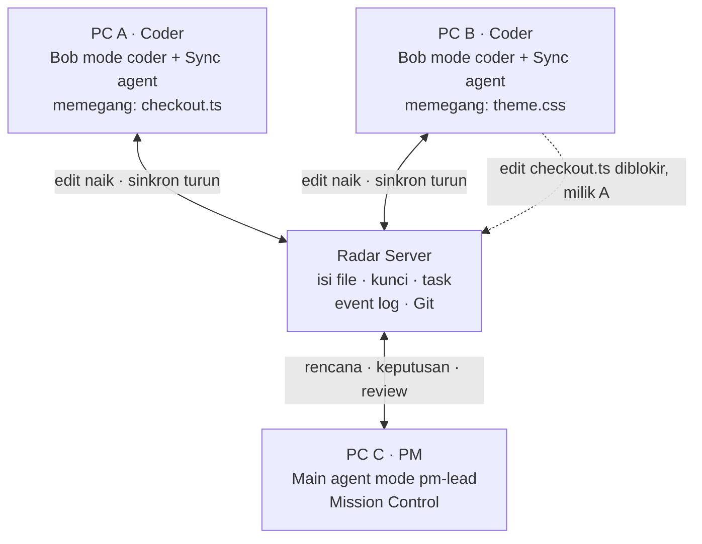

Semua perubahan lewat server, jadi server selalu tahu isi terbaru setiap file dan siapa pemegang kuncinya. PM tidak menulis kode. Ia hanya membaca dan memutuskan.

| Lapisan | Komponen | Isi |
|---|---|---|
| Di setiap PC | **Sync agent + paket `.bob/`** | Sync agent memantau folder proyek dan menyinkronkan perubahan dua arah. Paket `.bob/` berisi mode `coder` dan `pm-lead`, 5 hook, dan server MCP `radar-mcp`. |
| Di cloud | **Radar Server** | Pusat kebenaran: isi file terbaru, kunci, task, antrean permintaan, dan event log. Membuat commit Git otomatis setiap task disetujui. |
| Di layar PM | **Mission Control** | Task board, pohon file dengan kunci berwarna, antrean keputusan yang menunggu PM, dan feed live. Ada mode replay untuk juri. |

---

## 03. Masalah & posisi

| Temuan | Angka | Sumber |
|---|---|---|
| Pasangan PR dari agent berbeda yang berkonflik (33.596 PR, 2.807 repo) | **41,7%** (agent yang sama: 19,8%) | [arXiv 2607.04697](https://arxiv.org/html/2607.04697v2) |
| Waktu review PR dan ukuran PR di tim yang memakai AI | review +91%, ukuran +154% | [Faros AI](https://www.faros.ai/blog/ai-software-engineering) |
| Developer yang bilang agent konsisten mengikuti standar tim | 35% | [Qodo 2026](https://www.qodo.ai/blog/state-of-ai-code-quality-report-2026/) |
| Fitur tim di Bob saat ini | seats, billing, Bobalytics. Belum ada sesi bersama atau koordinasi antar-developer. | [Bob docs](https://bob.ibm.com/docs/ide/features/bobalytics) |
| Arah roadmap IBM | "multiple agents coordinate on a single task" | [Bob V2 blog](https://bob.ibm.com/blog/bob-v2-release-announcement/) |

### Dibanding alat yang ada

| Kemampuan | Git + PR | Live Share / Replit | MCP Agent Mail | Clash | **Bob Radar** |
|---|---|---|---|---|---|
| Perubahan terlihat live di PC lain | tidak | ya (manusia) | tidak | tidak | **ya (AI dan manusia)** |
| Kunci file untuk AI agent | tidak | tidak | sinyal saja | tidak | **ditegakkan di hook** |
| Lintas developer/mesin | ya, tapi terlambat | ya | ya | tidak | **ya** |
| Pembagian kerja di awal | manual | tidak | tidak | tidak | **main agent + PM** |
| Review sebelum commit | PR manual | tidak | tidak | tidak | **main agent + PM, per task** |

Sumber pembanding: [MCP Agent Mail](https://github.com/Dicklesworthstone/mcp_agent_mail), [Clash](https://github.com/clash-sh/clash).

---

## 04. Tujuan, non-tujuan & metrik

**Tujuan**

1. Semua anggota tim melihat perubahan yang dibuat AI siapa pun secara live.
2. Dua AI tidak pernah menulis file yang sama pada waktu yang sama.
3. Rebutan file dicegah sejak perencanaan, dan kalau tetap terjadi, diselesaikan lewat keputusan PM.
4. Setiap task di-review sebelum masuk Git, dengan jejak siapa mengubah apa.

**Non-tujuan (MVP)**

- Dua orang mengetik di baris yang sama (CRDT ala Google Docs). Tidak dibutuhkan karena satu file satu penulis.
- File biner, `node_modules`, dan isi `.gitignore`.
- Banyak repo sekaligus, atau lebih dari 5 anggota.
- Chat tim, SSO/OAuth, dan agent selain Bob.

### Metrik keberhasilan

| Metrik | Target hackathon | Cara ukur |
|---|---|---|
| Latensi sinkron: edit tersimpan di PC A sampai muncul di disk PC B (p95) | < 1 detik | Timestamp di event log |
| Dua penulis di file yang sama pada waktu yang sama | 0 (dijamin oleh desain) | Audit event log |
| Latensi cek kunci di hook `PreToolUse` (p95) | < 300 ms | Log waktu di hook |
| Konflik saat merge di eksperimen 6 task | 0 dengan Radar (dibandingkan tanpa Radar) | Eksperimen A/B, lihat §17 |
| Waktu dari blokir sampai keputusan PM | < 60 detik di demo | Event `request.created` → `request.decided` |
| Masalah antar-file yang ditangkap review main agent | minimal 1 di demo | Event `review.flagged` |
| Kelengkapan bukti Bob | 100% sesi diekspor ke `bob_sessions/` | Checklist submission |

---

## 05. Peran & hak akses

Konfigurasi demo: tiga orang. A dan B adalah coder, C adalah PM. Setiap orang memakai Bob-nya sendiri dengan mode yang berbeda.

| Peran | Siapa | Deskripsi |
|---|---|---|
| **Coder** | A dan B | Memberi prompt ke Bob untuk mengerjakan task yang dibagikan. Bob mereka berjalan dalam mode `coder`. Menulis hanya file yang dialokasikan atau yang bebas, melihat perubahan rekan secara live, dan mengajukan task selesai untuk di-review. |
| **PM + main agent** | C | Mengawasi seluruh pekerjaan dari Mission Control. Bob milik C adalah main agent dalam mode `pm-lead`, dan tidak bisa mengedit kode. Main agent mengusulkan rencana, keputusan, dan hasil review. C menyetujui atau menolak lewat tombol di Mission Control. |
| **Penonton** | Juri | Membuka URL demo sendirian, tanpa Bob dan tanpa tim. Replay mode tanpa login dan tanpa API key, dengan link ke repo dan `bob_sessions/`. |

### Matriks hak akses

| Aksi | Bob coder | Coder (manusia) | Main agent | PM (manusia) |
|---|:---:|:---:|:---:|:---:|
| Membaca semua file | ya | ya | ya | ya |
| Menulis file miliknya atau file bebas | ya | ya | tidak | tidak |
| Menulis file yang dikunci orang lain | tidak | tidak | tidak | tidak |
| Membuat rencana task dan alokasi file | tidak | tidak | usul | setujui |
| Memutuskan rebutan file | minta | minta | usul | setujui |
| Me-review task dan menyetujui commit | tidak | tidak | usul | setujui |
| Mencabut kunci secara paksa | tidak | tidak | tidak | ya |

> **Prinsip governance:** main agent tidak bisa menyetujui usulannya sendiri. Tool MCP-nya hanya bisa membuat usulan. Persetujuan hanya bisa datang dari tombol di Mission Control, yang ditekan manusia.

---

## 06. Konsep inti & aturan kunci

| Konsep | Arti |
|---|---|
| **Workspace** | Satu salinan proyek yang sama di setiap PC, disinkronkan oleh server. Sumber kebenarannya ada di server. |
| **Task** | Satu unit kerja dengan judul, deskripsi, pemilik (coder), dan daftar file yang dialokasikan. |
| **Alokasi** | File yang dipesan untuk sebuah task saat rencana disetujui. Orang lain tidak bisa menulisnya. |
| **Kunci** | Hak menulis sebuah file. Pemegangnya adalah pasangan coder + task. |
| **Permintaan** | Dibuat otomatis saat Bob coder diblokir. Masuk ke antrean keputusan PM. |

### Aturan kunci

1. **Dipesan saat rencana disetujui.** File yang dialokasikan ke task berstatus *dipesan* untuk pemilik task itu.
2. **Diambil saat edit pertama.** Hook `PreToolUse` mengubah status *dipesan* menjadi *dipegang*. File yang tidak dialokasikan ke siapa pun dan masih bebas langsung diberikan ke coder yang pertama menulisnya.
3. **Dipegang sampai task disetujui.** Kunci tidak dilepas setelah setiap edit, dan juga tidak saat Bob selesai menjawab satu prompt. Kunci dilepas saat task disetujui PM. Kalau dilepas lebih awal, dua AI bisa bergantian menyelipkan perubahan ke file yang sama.
4. **Membaca selalu bebas.** Yang dikunci hanya hak menulis.
5. **Manusia ikut aturan yang sama.** Kalau coder mengetik manual di file milik orang lain, sync agent menolak perubahan itu, mengembalikan isi file dari server, dan memberi tahu coder tersebut.
6. **Antrean per file.** Kalau dua task butuh file yang sama, PM memutuskan urutannya. Saat task pertama disetujui, kunci pindah ke task berikutnya di antrean.
7. **Kunci punya batas hidup.** Sync agent mengirim heartbeat setiap 15 detik. Kalau PC pemegang kunci tidak terdengar selama 5 menit, PM mendapat peringatan dan bisa mencabut kuncinya.

### Hasil cek di hook `PreToolUse`

| Kondisi file | Hasil | Aksi |
|---|---|---|
| Dipesan atau dipegang oleh task saya | 🟢 izinkan | exit 0. Status menjadi *dipegang* kalau belum. |
| Bebas, tidak dialokasikan ke siapa pun | 🟢 izinkan + ambil | exit 0. Kunci diberikan ke task aktif saya, dan main agent diberi tahu. |
| Dipesan atau dipegang orang lain | 🔴 blokir | exit 2. Permintaan dibuat otomatis dan masuk ke antrean PM. |
| Server tidak menjawab dalam 1,5 detik | 🟡 izinkan (fail-open) | exit 0 dan dicatat. Sync agent tetap menolak di sisi server kalau file ternyata milik orang lain. |

> **Dua lapis penegakan.** Hook mencegah Bob menulis. Sync agent dan server menjadi lapis kedua: server menolak setiap update ke file yang bukan milik pengirimnya. Lapis kedua ini juga menangkap edit yang lolos dari hook, misalnya lewat perintah shell (`sed -i`) atau ketikan manual.

---

## 07. User flow

### 7.1 Satu sesi tim dari awal sampai akhir

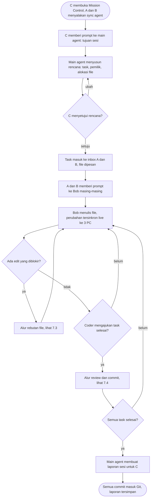

Rebutan file dan review adalah dua titik di mana PM terlibat. Di luar itu, coder bekerja paralel tanpa menunggu.

### 7.2 Coder bekerja dengan Bob

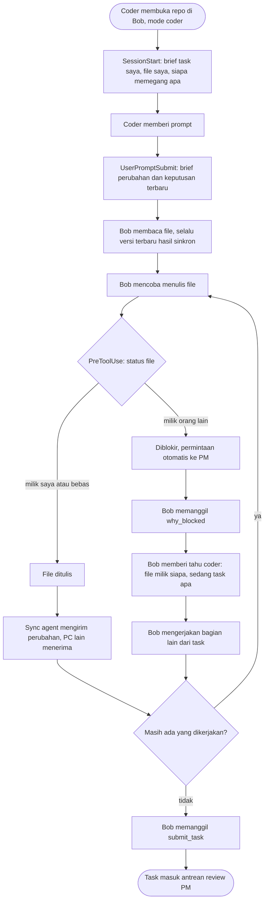

Bob coder tidak pernah mencoba ulang edit yang diblokir. Keputusan PM sampai ke Bob lewat brief di prompt berikutnya.

### 7.3 Rebutan file

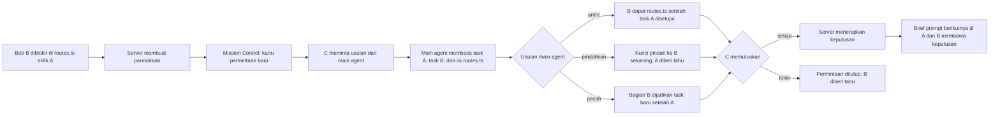

Usulan "antre" boleh diterapkan otomatis tanpa klik PM, karena tidak mengambil apa pun dari siapa pun. Pemindahan kunci selalu butuh persetujuan PM.

### 7.4 Review dan commit

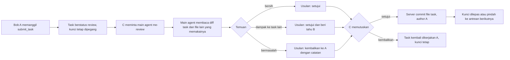

Karena setiap file hanya dipegang satu task, commit per task selalu bersih: server cukup meng-commit file milik task itu.

### 7.5 Coder mengetik manual di file milik orang lain

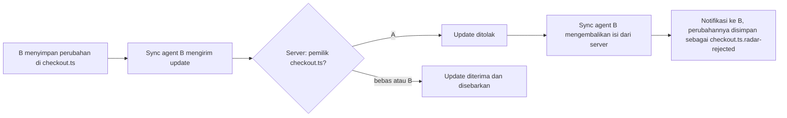

Perubahan yang ditolak tidak dibuang. Isinya disimpan di file sampingan supaya coder bisa menyalinnya nanti.

### 7.6 Juri menonton demo

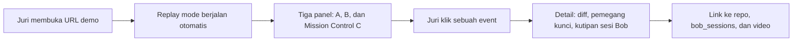

---

## 08. Alur sistem

### 8.1 Edit live dan blokir

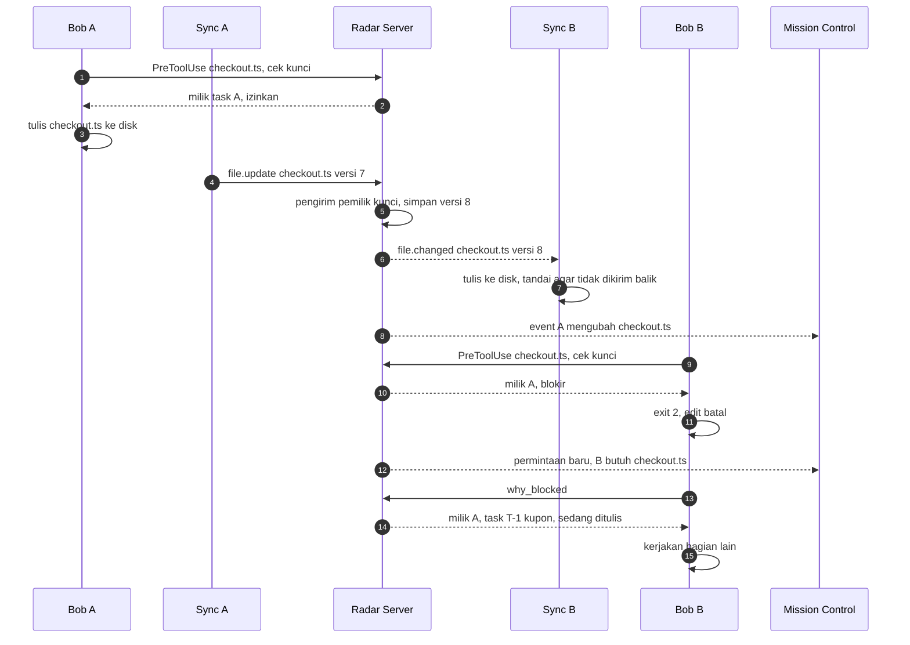

Langkah 4 sampai 7 adalah sinkronisasi live. Langkah 9 sampai 13 adalah blokir. Server memeriksa pemilik kunci dua kali: saat hook bertanya, dan saat update file masuk.

### 8.2 Keputusan PM

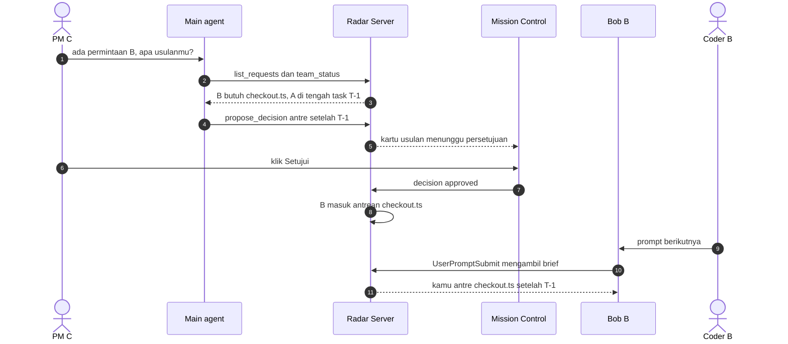

Persetujuan hanya lewat Mission Control (langkah 6). Main agent tidak punya tool untuk menyetujui usulannya sendiri.

### 8.3 Mekanisme sinkron

- **Deteksi perubahan:** sync agent memantau folder proyek, mengabaikan `.git/`, `node_modules/`, isi `.gitignore`, dan file di atas 1 MB. Perubahan ditunda 150 ms untuk menggabungkan beberapa simpanan beruntun.
- **Kirim isi utuh, bukan diff.** Setiap update berisi path, versi dasar, isi file, dan hash. Untuk repo kecil ini paling sederhana dan paling andal.
- **Server memeriksa pemilik.** Update diterima kalau pengirim memegang kunci, atau file bebas. Versi naik satu, lalu perubahan disebarkan ke semua PC lain.
- **Mencegah gema.** Saat sync agent menulis file kiriman server, ia mencatat hash-nya. Event pemantau untuk hash itu diabaikan, supaya file tidak dikirim balik dan berputar tanpa henti.
- **Bergabung dan tersambung ulang.** PC baru mengunduh snapshot seluruh workspace. PC yang terputus mengirim ulang perubahannya saat tersambung. Kalau versinya sudah tertinggal, server yang menang dan isi lokal disimpan sebagai `.radar-conflict`.
- **Hapus dan ganti nama** dikirim sebagai `file.deleted`, dan ganti nama dianggap hapus lalu buat. Keduanya juga butuh kunci.

---

## 09. Siklus hidup

### Siklus kunci sebuah file

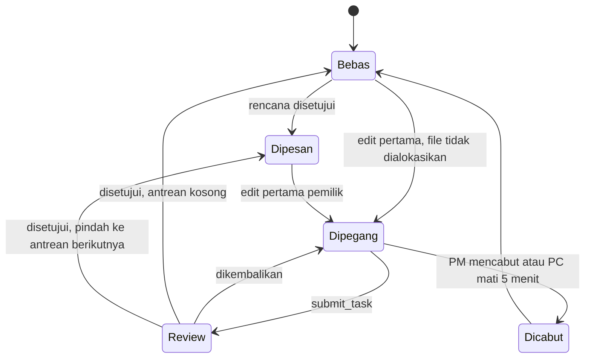

### Siklus sebuah task

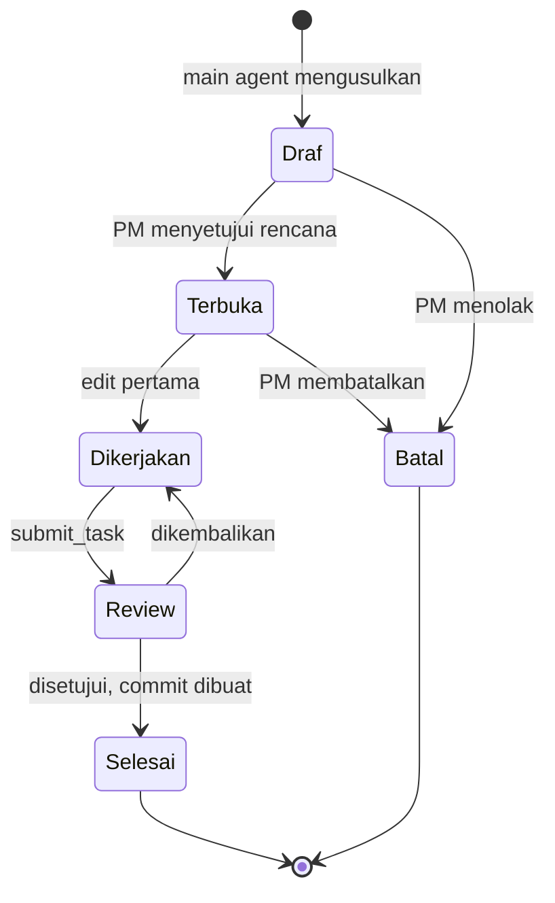

---

## 10. Requirement fungsional

**P0** wajib untuk demo. **P1** dikerjakan kalau P0 selesai sebelum Sabtu 23:00 WITA. **P2** masuk roadmap di deck.

### 10.1 Sync agent

| ID | Requirement | Kriteria penerimaan | Prioritas |
|---|---|---|---|
| SY-01 | Bergabung ke workspace | `radar join <workspace> --as A` mengunduh snapshot dan mulai memantau folder. | P0 |
| SY-02 | Kirim perubahan lokal | File teks yang disimpan terkirim dalam < 300 ms setelah jeda 150 ms. | P0 |
| SY-03 | Terima perubahan dari server | File ditulis ke disk dan tidak dikirim balik (pencegahan gema berbasis hash). | P0 |
| SY-04 | Tolak update ke file milik orang lain | Isi dikembalikan dari server, perubahan lokal disimpan ke `.radar-rejected`, notifikasi tampil. | P0 |
| SY-05 | Heartbeat | Setiap 15 detik ke server. | P0 |
| SY-06 | Hapus dan ganti nama | Tersinkron ke PC lain, dan butuh kunci. | P1 |
| SY-07 | Tersambung ulang | Perubahan saat offline dikirim ulang. Kalau versi tertinggal, isi lokal disimpan ke `.radar-conflict`. | P1 |

### 10.2 Radar Server: file, kunci, task

| ID | Requirement | Kriteria penerimaan | Prioritas |
|---|---|---|---|
| SV-01 | Simpan isi file terbaru dengan nomor versi | Setiap update yang diterima menaikkan versi dan disebarkan ke semua klien lain lewat WebSocket. | P0 |
| SV-02 | Cek kunci untuk hook | `POST /v1/locks/check` mengembalikan izinkan/blokir sesuai tabel §06. p95 < 300 ms. | P0 |
| SV-03 | Tolak update dari bukan pemilik | Update ke file milik orang lain dijawab `rejected`, tanpa mengubah isi. | P0 |
| SV-04 | Rencana dan alokasi | Rencana yang disetujui membuat task dan memesan file sesuai alokasi. | P0 |
| SV-05 | Permintaan otomatis saat blokir | Setiap blokir membuat satu permintaan (tidak duplikat untuk file dan task yang sama). | P0 |
| SV-06 | Antrean per file | Saat task disetujui, kunci pindah ke task berikutnya di antrean dan pemiliknya diberi tahu. | P0 |
| SV-07 | Commit per task | Saat review disetujui, server meng-commit file milik task dengan author coder, trailer `Co-authored-by: IBM Bob`, `Radar-Task`, dan `Reviewed-by`, lalu push ke GitHub. | P0 |
| SV-08 | Event log | Setiap kejadian tercatat dan bisa diekspor sebagai JSON untuk replay. | P0 |
| SV-09 | Kunci kedaluwarsa | Tanpa heartbeat 5 menit, PM diberi peringatan dan bisa mencabut kunci. | P1 |
| SV-10 | Pemicu main agent otomatis | Setiap permintaan baru menjalankan `bob run --mode pm-lead --max-cost` di PC C untuk membuat usulan. | P1 |

### 10.3 Integrasi Bob untuk coder

| ID | Requirement | Kriteria penerimaan | Prioritas |
|---|---|---|---|
| BC-01 | Custom mode `coder` | Bob mulai dengan `my_tasks`. Setelah diblokir, Bob memanggil `why_blocked`, tidak mencoba ulang, dan tidak mengedit lewat shell. Saat selesai, Bob memanggil `submit_task`. | P0 |
| BC-02 | Hook `SessionStart` | Mencetak brief paling banyak 6 baris: task saya, file saya, siapa memegang apa. | P0 |
| BC-03 | Hook `UserPromptSubmit` | Menyisipkan keputusan PM dan pemberitahuan baru sejak prompt terakhir, termasuk file yang baru diubah rekan. | P0 |
| BC-04 | Hook `PreToolUse` untuk `^(write_file\|apply_diff\|search_and_replace\|insert_content)$` | Payload dinormalisasi dari dua bentuk (`event/tool/input` dan `hook_event_name/tool_name/tool_input`). Blokir menghasilkan exit 2 dan file tidak berubah. | P0 |
| BC-05 | Hook `PostToolUse` | Menandai perubahan sebagai buatan AI (bukan ketikan manusia) di event log. | P1 |
| BC-06 | Hook `Stop` | Mengirim ringkasan giliran Bob ke feed. Tidak melepas kunci. | P2 |
| BC-07 | Tool MCP coder | `my_tasks`, `why_blocked`, `request_file`, `team_activity`, `submit_task` berfungsi. | P0 |

### 10.4 Main agent (Bob milik PM)

| ID | Requirement | Kriteria penerimaan | Prioritas |
|---|---|---|---|
| MA-01 | Custom mode `pm-lead` tanpa hak edit | Mode hanya punya grup tool baca dan MCP. Bob tidak bisa menulis file walaupun diminta. | P0 |
| MA-02 | Menyusun rencana | Dari satu tujuan, main agent memanggil `propose_plan` dengan task, pemilik, dan alokasi file tanpa file yang tumpang tindih. Kalau tidak bisa dihindari, file bersama ditandai antre. | P0 |
| MA-03 | Menengahi rebutan | `list_requests` lalu `propose_decision` dengan pilihan antre, pindahkan, atau pecah, disertai alasan. | P0 |
| MA-04 | Review task | `get_task_diff` mengembalikan diff task dan daftar file task lain yang meng-import file yang berubah. Main agent memanggil `propose_review` dengan status setujui, setujui dan beri tahu, atau kembalikan. | P0 |
| MA-05 | Pemberitahuan ke coder | `notify(dev, pesan)` muncul di brief prompt berikutnya milik coder itu. | P0 |
| MA-06 | Laporan sesi | `session_report` menghasilkan ringkasan: task, commit, blokir, keputusan, dan waktu. | P1 |
| MA-07 | Tidak bisa menyetujui diri sendiri | Tidak ada tool MCP untuk menyetujui. Semua endpoint persetujuan hanya menerima token Mission Control. | P0 |

### 10.5 Mission Control dan replay

| ID | Requirement | Kriteria penerimaan | Prioritas |
|---|---|---|---|
| UI-01 | Task board | Kolom Draf, Dikerjakan, Review, Selesai. Kartu menampilkan pemilik dan jumlah file. | P0 |
| UI-02 | Pohon file dengan kunci | Setiap file menampilkan chip pemegang (warna per orang), status dipesan/dipegang/review, dan penanda "sedang ditulis" selama 3 detik setelah update. | P0 |
| UI-03 | Antrean keputusan | Usulan rencana, keputusan rebutan, dan review tampil sebagai kartu dengan tombol Setujui dan Tolak. | P0 |
| UI-04 | Feed live | Event muncul < 1 detik setelah terjadi. | P0 |
| UI-05 | Replay di `/demo` | Memutar event log dari file JSON statis, tanpa login dan tanpa API key. | P0 |
| UI-06 | Diff viewer | Klik file atau event menampilkan diff terakhir. | P1 |
| UI-07 | Tampilan coder ringkas | Halaman kecil untuk A dan B: task saya, file saya, notifikasi. | P1 |

---

## 11. Layar

### Mission Control (layar PM)

Layar ini juga menjadi cover 16:9 dan panel tengah di video demo. Isi di bawah adalah contoh skenario, bukan data nyata.

```text
┌──────────────────────────────────────────────────────────────────────────────────────┐
│ Mission Control · toko-demo        ● live · 3 PC terhubung      [A·coder][B·coder][C·PM] │
├─────────────────────────────┬──────────────────────────┬─────────────────────────────┤
│ TASK BOARD                  │ FILE & KUNCI             │ MENUNGGU KEPUTUSAN          │
│                             │                          │                             │
│ Dikerjakan      Review      │ src/checkout/            │ [blokir] B butuh checkout.ts│
│ ┌───────────┐ ┌───────────┐ │  checkout.ts  ✎    [A]   │ (milik A, T-1)              │
│ │T-1 Kupon  │ │T-0 Ongkir │ │  coupon.ts         [A]   │ Usulan main agent: B antre  │
│ │[A] 3 file │ │[A] tunggu │ │ src/ui/                  │ sampai T-1 disetujui, lanjut│
│ │14 edit    │ │PM         │ │  theme.css    ✎    [B]   │ ke Header.tsx dulu.         │
│ └───────────┘ └───────────┘ │  Header.tsx        [B]   │   [ Setujui ]  [ Tolak ]    │
│ ┌───────────┐ Selesai       │ src/                     │                             │
│ │T-2 Dark   │ ┌───────────┐ │  routes.ts   [A] antre:B │ [review] T-0 Setup ongkir   │
│ │mode [B]   │ │T-00 Skema │ │  utils.ts        bebas   │ Usulan: setujui, beri tahu  │
│ │2 file     │ │[B] 3f9a2c1│ │                          │ B. calculateTotal() kini    │
│ └───────────┘ └───────────┘ │  ✎ = sedang ditulis      │ butuh parameter ongkir.     │
│                             │                          │  [ Setujui ] [ Kembalikan ] │
│                             │                          │                             │
│                             │                          │ FEED LIVE                   │
│                             │                          │ 21:06 Bob A ubah checkout.ts│
│                             │                          │ 21:06 Bob B diblokir        │
│                             │                          │ 21:05 Bob B ubah theme.css  │
│                             │                          │ 21:03 A ajukan T-0 review   │
└─────────────────────────────┴──────────────────────────┴─────────────────────────────┘
```

Tiga kolom mengikuti urutan pertanyaan PM: siapa mengerjakan apa (task), di mana (file dan kunci), dan apa yang butuh saya (keputusan). Di layar sempit, kolom-kolomnya ditumpuk.

### Layar coder

Coder bekerja di Bob IDE seperti biasa. Yang berbeda hanya tiga hal:
- brief Radar muncul di awal sesi dan di setiap prompt,
- file yang dikunci orang lain ditolak dengan penjelasan dari Bob,
- file milik rekan berubah sendiri di editor saat rekan menulisnya.

Halaman status kecil untuk coder (UI-07) adalah P1.

### Prinsip UX

- **Coder tidak pernah menunggu tanpa pekerjaan.** Setiap blokir disertai arahan ke bagian lain dari task.
- **PM melihat ringkasan dulu, detail kemudian.** Kartu keputusan selalu berisi usulan main agent dan alasannya dalam satu kalimat.
- **Brief yang hemat.** Semua teks yang disisipkan ke konteks Bob dibatasi 6 baris, karena setiap karakter memakan Bobcoin.
- **Warna per orang konsisten** di semua layar: A biru, B ungu, C oranye. Merah, kuning, hijau hanya untuk status.

---

## 12. Arsitektur

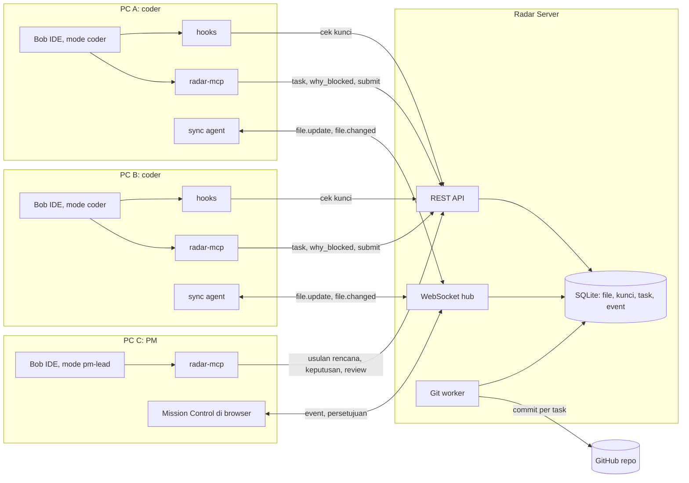

Hook dan tool MCP memakai REST karena singkat dan sinkron. Sync agent dan Mission Control memakai WebSocket karena butuh dorongan dari server.

### Stack yang disarankan

| Bagian | Pilihan | Alasan |
|---|---|---|
| Semua kode | TypeScript di Node 20 | Satu bahasa untuk sync agent, server, hook, MCP, dan UI |
| Sync agent | CLI Node: `chokidar` + `ws` | Pemantau file yang matang di semua OS |
| Server | Fastify + `ws` + `better-sqlite3` + `simple-git`, di Fly.io, Render, atau Railway | Butuh proses yang hidup terus untuk WebSocket dan Git. Serverless tidak cocok. |
| Hook | Script Node kecil + `radar-common` | Normalisasi payload dan HTTP di satu tempat |
| radar-mcp | MCP TypeScript SDK, transport stdio | Dibangun bersama Bob mengikuti tutorial resmi "Build MCP servers" |
| Mission Control | Next.js di Vercel | Replay mode statis tetap hidup walaupun server mati |

---

## 13. Data, API & konfigurasi

### Model data

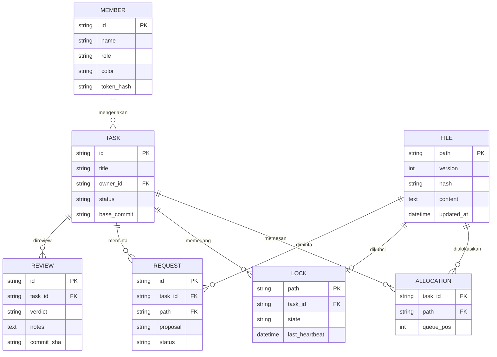

Tabel `event` (id, ts, actor, type, payload) tidak digambar. Setiap perubahan di tabel lain juga ditulis ke sana sebagai sumber feed dan replay.

### REST API

| Metode | Path | Dipanggil oleh | Fungsi |
|---|---|---|---|
| POST | `/v1/locks/check` | Hook PreToolUse | Izinkan atau blokir. Otomatis mengambil kunci file bebas. Otomatis membuat permintaan saat blokir. |
| GET | `/v1/brief?member=&since=` | Hook SessionStart, UserPromptSubmit | Brief pendek: task, kunci, keputusan, pemberitahuan |
| GET | `/v1/tasks?owner=` | MCP `my_tasks` | Task milik coder beserta alokasi file |
| GET | `/v1/blocks/last?member=` | MCP `why_blocked` | Pemilik file, task-nya, dan saran |
| POST | `/v1/tasks/{id}/submit` | MCP `submit_task` | Task masuk review |
| POST | `/v1/proposals` | MCP main agent | Usulan rencana, keputusan, atau review. Status selalu *menunggu*. |
| GET | `/v1/tasks/{id}/diff` | MCP `get_task_diff` | Diff sejak `base_commit` + file lain yang meng-import file yang berubah |
| POST | `/v1/proposals/{id}/decision` | Mission Control saja | Setujui atau tolak. Butuh token Mission Control. |
| GET | `/v1/events/export` | Tim | JSON untuk replay |

### Pesan WebSocket

| Pesan | Arah | Isi |
|---|---|---|
| `hello` | klien → server | member, token, peran |
| `snapshot` | server → klien | semua file + versi, saat bergabung |
| `file.update` | sync agent → server | path, base_version, content, hash |
| `file.changed` | server → semua klien lain | path, version, content, hash, by |
| `file.rejected` | server → pengirim | path, pemilik, isi server |
| `lock.changed` | server → semua | path, state, task, antrean |
| `proposal.new` / `proposal.decided` | server → Mission Control | jenis, isi, alasan, status |
| `heartbeat` | sync agent → server | member, waktu |

### Konfigurasi Bob

```yaml
# .bob/custom_modes.yaml  (nama grup tool diverifikasi saat spike)
customModes:
  - slug: coder
    name: Radar Coder
    roleDefinition: Kamu adalah coder di workspace multiplayer Bob Radar.
    customInstructions: |
      1. Mulai setiap sesi dengan radar.my_tasks. Kerjakan hanya task milikmu.
      2. Kalau sebuah edit ditolak, JANGAN coba ulang dan JANGAN ubah file lewat shell.
         Panggil radar.why_blocked, beri tahu user, lalu kerjakan bagian lain.
      3. File bisa berubah karena rekan. Baca ulang file sebelum mengeditnya.
      4. Saat task selesai, panggil radar.submit_task dengan ringkasan singkat.
    groups: [read, edit, command, mcp]
  - slug: pm-lead
    name: Radar PM Lead
    roleDefinition: Kamu adalah main agent yang membantu PM mengatur tim coder. Kamu tidak menulis kode.
    customInstructions: |
      1. Susun rencana dengan radar.propose_plan. Hindari file yang sama di dua task.
         Kalau tidak bisa dihindari, tandai file itu sebagai antre.
      2. Untuk rebutan file, baca kedua task lalu radar.propose_decision dengan alasan satu kalimat.
      3. Untuk review, pakai radar.get_task_diff. Cek dampak ke file task lain, lalu radar.propose_review.
      4. Semua usulan menunggu persetujuan PM di Mission Control. Kamu tidak bisa menyetujuinya.
    groups: [read, mcp]
```

```jsonc
// .bob/settings.json  (dipakai di PC coder)
{
  "hooks": {
    "SessionStart":     [{ "hooks": [{ "type": "command", "command": "node .bob/hooks/brief.js start",  "timeout": 5 }] }],
    "UserPromptSubmit": [{ "hooks": [{ "type": "command", "command": "node .bob/hooks/brief.js prompt", "timeout": 5 }] }],
    "PreToolUse": [{
      "matcher": "^(write_file|apply_diff|search_and_replace|insert_content)$",
      "hooks": [{ "type": "command", "command": "node .bob/hooks/lock_guard.js", "timeout": 3 }]
    }],
    "PostToolUse": [{
      "matcher": "^(write_file|apply_diff|search_and_replace|insert_content)$",
      "hooks": [{ "type": "command", "command": "node .bob/hooks/mark_ai_edit.js", "timeout": 3 }]
    }]
  }
}
```

### Tool MCP `radar-mcp`

| Untuk coder | Untuk main agent |
|---|---|
| `my_tasks()` | `team_status()` |
| `why_blocked()` | `propose_plan(tujuan, tasks[])` |
| `request_file(path, alasan)` | `list_requests()` |
| `team_activity(path?)` | `propose_decision(request_id, antre \| pindahkan \| pecah, alasan)` |
| `submit_task(task_id, ringkasan)` | `get_task_diff(task_id)` |
| | `propose_review(task_id, verdict, catatan)` |
| | `notify(member, pesan)` |
| | `session_report()` |

---

## 14. Requirement non-fungsional

| ID | Aspek | Requirement |
|---|---|---|
| NFR-01 | Latensi | Sinkron p95 < 1 detik. Cek kunci p95 < 300 ms. Batas waktu hook 3 detik. |
| NFR-02 | Konsistensi | Server adalah satu-satunya sumber kebenaran. Setiap file punya nomor versi yang naik terus. Tidak ada dua penulis aktif untuk satu file. |
| NFR-03 | Ketersediaan | Hook fail-open kalau server tidak menjawab, dengan lapis kedua di server. Replay mode tidak bergantung pada server. |
| NFR-04 | Keamanan | Token per anggota. Endpoint persetujuan hanya menerima token Mission Control. Tidak ada secret di repo, log hook, atau `bob_sessions/`. Jalankan gitleaks di seluruh history. Hook berjalan dengan izin penuh user, dan ini diakui di deck. |
| NFR-05 | Privasi | MVP menyimpan isi file di server tim. Roadmap: server self-hosted di jaringan perusahaan. |
| NFR-06 | Biaya Bobcoin | Brief ≤ 6 baris. Main agent dipanggil hanya saat ada usulan yang dibutuhkan. `--max-cost` untuk pemicu otomatis. |
| NFR-07 | Data | Repo contoh dengan data sintetis. Tidak ada data pribadi, klien, atau media sosial. |
| NFR-08 | Kompatibilitas | Bob IDE ≥ 2.0.1 (versi 2.0.0 berhenti berfungsi 30 Sep 2026), Bob Shell 2.x, Node 20, git ≥ 2.38. macOS, Windows, dan Linux. |
| NFR-09 | Bisa diaudit | Setiap keputusan PM, usulan main agent, dan commit tercatat di event log. Semua sesi Bob diekspor ke `bob_sessions/<nama>/`. |

---

## 15. Naskah demo (±4 menit)

Layar dibagi tiga: A di kiri, Mission Control C di tengah, B di kanan. Rekam versi terbaik pada Minggu pagi sebagai cadangan.

| Waktu | Adegan |
|---|---|
| 0:00–0:25 | **Masalah.** "41,7% PR dari AI agent yang berbeda saling bentrok. Tim kalian punya tiga orang dan tiga AI, tapi masing-masing bekerja di dunianya sendiri." |
| 0:25–0:45 | **Ide.** "Bob Radar membuat tim yang memakai Bob bekerja seperti di Google Docs: satu workspace live, satu file satu AI, dan satu main agent untuk PM." |
| 0:45–1:15 | **Rencana.** C mengetik "Tambah fitur kupon dan dark mode". Main agent mengusulkan dua task dengan alokasi file yang tidak tumpang tindih. C mengklik Setujui, dan kunci berwarna muncul di pohon file. |
| 1:15–2:00 | **Live.** A dan B memberi prompt ke Bob masing-masing. File di layar B berubah sendiri saat Bob A menulis `checkout.ts`, dan sebaliknya untuk `theme.css`. Penanda "sedang ditulis" berkedip di Mission Control. |
| 2:00–2:40 | **Blokir.** Bob B mencoba menulis `checkout.ts` dan ditolak. Bob B menjelaskan sendiri: "File ini sedang dikerjakan Bob milik A untuk task kupon. Saya lanjut ke Header.tsx dulu." Kartu permintaan muncul di Mission Control. Main agent mengusulkan "antre", dan C menyetujui. |
| 2:40–3:15 | **Review.** A mengajukan task. Main agent menemukan bahwa `calculateTotal()` berubah dan dipakai di file milik B, lalu mengusulkan "setujui dan beri tahu B". C menyetujui, dan commit muncul di GitHub atas nama A dengan co-author IBM Bob. Kunci `checkout.ts` pindah ke B. |
| 3:15–3:40 | **Di balik layar dan angka.** Tampilkan `custom_modes.yaml`, hooks, tool MCP, cuplikan `bob_sessions/`, dan hasil eksperimen A/B. |
| 3:40–4:00 | **Penutup.** Target user, model bisnis, roadmap (pemicu otomatis, self-hosted, `EnforcedHooks`), dan link replay untuk juri. |

---

## 16. Scope & rencana rilis

| Rilis | Isi |
|---|---|
| **R0 · submit hackathon (MVP demo)** | Semua requirement P0 · Tiga PC, satu repo contoh kecil · Main agent dipanggil manual oleh PM · Replay mode + eksperimen A/B · `bob_sessions/`, README juri, `BOB_DEVELOPMENT.md` |
| **R1 · 4–6 minggu (pilot tim)** | Main agent otomatis via `bob run` · Hapus/ganti nama dan tersambung ulang · Diff viewer, tampilan coder · Login dan undangan |
| **R2 · enterprise** | `EnforcedHooks` untuk seluruh org · Server self-hosted · Integrasi PR dan CI · Lebih dari 5 anggota, multi-repo |

### Yang sengaja dipotong

Edit bersama di baris yang sama, chat tim, file biner, OAuth, Slack, dan aplikasi mobile. Semua ini menarik, tapi setiap item memakan waktu yang dibutuhkan untuk menyempurnakan satu alur demo.

### Kalau waktu mepet, potong dengan urutan ini

1. Hook `PostToolUse` penanda AI (BC-05)
2. Hapus dan ganti nama file (SY-06)
3. Diff viewer (UI-06)
4. Laporan sesi (MA-06)
5. Terakhir sekali: review main agent disederhanakan menjadi ringkasan diff saja, tanpa cek dampak antar-file

---

## 17. Rencana 48 jam

### Spike (Sab 01:00–04:00 WITA)

1. Hook `PreToolUse` terpicu untuk tool edit, dan exit 2 benar-benar mencegah file berubah.
2. Setelah diblokir, apa persisnya yang diterima model?
3. Stdout `UserPromptSubmit` masuk ke konteks Bob.
4. Edit yang ditulis Bob memicu `chokidar`, dan file muncul di PC kedua dalam < 1 detik.
5. Mode dengan grup `[read, mcp]` benar-benar tidak bisa menulis file.
6. Tool MCP stdio bisa dipanggil dari mode `coder` dan `pm-lead`.

> **GATE 1, Sabtu 04:00.** Kalau poin 1 gagal, penegakan dipindah sepenuhnya ke sync agent dan server: update ke file milik orang lain langsung ditolak dan dikembalikan (SY-04). Produk tetap jalan tanpa pivot, hanya penjelasan dari Bob yang lebih lemah. Kalau poin 4 gagal, turunkan ke polling setiap 1 detik.

### Pembagian kerja tim pembangun (3 orang)

| Waktu (WITA) | Orang 1: server + sync | Orang 2: integrasi Bob | Orang 3: Mission Control + pitch |
|---|---|---|---|
| Jum 23:00–Sab 01:00 | Kickoff bersama, baca guide 2.0, cocokkan PRD dengan track dan rubrik | ← sama | ← sama |
| Sab 01:00–04:00 | Spike 4, deploy server kosong | Spike 1, 2, 3, 5, 6 | Setup Next.js + Vercel, lalu tidur 02:00 |
| Sab 04:00–10:00 | Protokol sinkron, `file.update`/`changed`, pencegahan gema | Tidur | Tidur sampai 08:00, lalu layout Mission Control |
| Sab 10:00–16:00 | Tidur | Mode `coder`, 4 hook, tool MCP coder | Pohon file + task board via WebSocket |
| Sab 16:00–23:00 | Kunci, alokasi, antrean, permintaan, penolakan update | Mode `pm-lead`, tool MCP main agent, `get_task_diff` | Antrean keputusan + tombol, feed |
| **Sab 23:00** | **Alur penuh jalan di 3 PC: rencana, live, blokir, keputusan** | | |
| Sab 23:00–Min 05:00 | Commit per task + push GitHub, lalu tidur bergilir | Review + notify, uji ulang, lalu tidur bergilir | Replay mode, script video v1, deck v1 |
| Min 05:00–11:00 | Hardening, heartbeat, test | Eksperimen A/B, ekspor `bob_sessions/` | Rekam footage 3 layar |
| **Min 11:00** | **GATE 2: feature freeze** | | |
| Min 11:00–19:00 | README juri, gitleaks seluruh history | `BOB_DEVELOPMENT.md` + tabel metrik | Edit video, deck PDF, cover 16:9, deskripsi |
| Min 19:00–21:00 | Submit | | |
| Min 21:00–23:00 | Buffer: cek di jendela incognito, repo publik, video bisa diputar, tidak ada secret | | |

Kalau tim berisi 4 orang, orang keempat memegang pitch penuh sejak Sabtu 23:00, dan Orang 3 fokus di Mission Control.

### Eksperimen A/B untuk angka pitch

1. Repo toko online kecil dengan data sintetis, dan 6 task yang secara alami bersinggungan di `checkout.ts`, `routes.ts`, dan `utils.ts`.
2. **Putaran A, cara biasa:** dua coder dengan Bob di branch masing-masing. Catat konflik saat merge, menit resolusi, dan Bobcoin yang terpakai.
3. **Putaran B, dengan Bob Radar:** task yang sama di workspace live dengan PM. Catat blokir, waktu sampai keputusan, konflik saat merge, dan Bobcoin.
4. Laporkan apa adanya, termasuk bahwa sampelnya kecil dan skenarionya dirancang sendiri.

---

## 18. Risiko & open question

| Risiko | Dampak | Mitigasi |
|---|---|---|
| Konflik antar-file tidak tertangkap kunci (A mengubah parameter fungsi yang dipakai file B) | Kode rusak walaupun tidak ada bentrok file | Review main agent dengan cek file yang meng-import (MA-04) + `notify` |
| Kode setengah jadi ikut tersinkron, build B rusak sementara | Coder B bingung | Penanda "sedang ditulis" dan brief. Jawaban siap untuk juri: ini harga dari "live", seperti draf di Google Docs. |
| File yang dibutuhkan semua orang (`routes.ts`, `package.json`) | Coder menunggu | Main agent memisahkannya saat perencanaan, antrean per file, arahan ke bagian lain |
| Bob mencoba ulang setelah diblokir atau mengedit lewat shell | Demo kacau | Instruksi mode yang tegas + penolakan di server (lapis kedua) |
| Gema sinkron (file berputar tanpa henti) | CPU penuh, file berkedip | Pencegahan berbasis hash + test otomatis |
| Editor tidak memuat ulang file yang berubah dari luar | Coder melihat versi lama | Uji di spike. Bob membaca dari disk, jadi AI tetap melihat versi terbaru. |
| Juri menganggapnya "cuma Live Share + kunci" | Nilai originality turun | Tonjolkan main agent: pembagian kerja, penengahan, dan review. Tabel pembanding di §03. |
| Demo 3 PC gagal saat live | Presentasi turun | Rekaman cadangan + replay mode |
| Bobcoin habis (3 akun, main agent ikut memakai) | Tidak bisa merekam | Anggaran per akun, eksperimen dijadwalkan Minggu pagi, `--max-cost` |
| Track 2.0 tidak cocok | Nilai kecocokan turun | Bingkai sebagai team workflow, governance, atau SDLC orchestration |

### Open question yang dijawab saat spike dan kickoff

1. Setelah exit 2, apa persisnya yang diterima model?
2. Apa nama grup tool yang benar di `custom_modes.yaml` Bob 2.x, dan apakah grup `mcp` ada?
3. Apa nama tool eksekusi perintah di Bob 2.x?
4. Apakah Bob IDE memuat ulang file yang diubah dari luar secara otomatis?
5. Apakah hook berjalan sama di Bob Shell dan Bob IDE?
6. Berapa Bobcoin per peserta di edisi 2.0, apakah `bob_sessions/` masih wajib, dan model watsonx mana yang dilarang?
7. Track dan rubrik resmi Bob 2.0.

---

## 19. Istilah

| Istilah | Arti di dokumen ini |
|---|---|
| Main agent | Bob milik PM dalam mode `pm-lead`. Mengusulkan, tidak menyetujui, tidak menulis kode. |
| Mission Control | Layar web milik PM: task board, pohon file berkunci, antrean keputusan, feed |
| Sync agent | Program kecil di setiap PC yang menyinkronkan folder proyek dengan server |
| Kunci | Hak menulis sebuah file, dipegang satu task. Status: bebas, dipesan, dipegang, review, dicabut. |
| Alokasi | File yang dipesan untuk sebuah task saat rencana disetujui |
| Permintaan | Dibuat otomatis saat Bob coder diblokir. Diputuskan PM. |
| Brief | Teks pendek yang disisipkan ke konteks Bob lewat `SessionStart` atau `UserPromptSubmit` |

---

## Sumber

- [IBM Bob — Lifecycle hooks](https://bob.ibm.com/docs/ide/configuration/lifecycle-hooks)
- [The Main Thread — uji hooks Bob 2.0.2](https://www.the-main-thread.com/p/ibm-bob-lifecycle-hooks-agentic-development)
- [IBM Bob — Custom modes](https://bob.ibm.com/docs/ide/configuration/custom-modes)
- [IBM Bob V2 release blog](https://bob.ibm.com/blog/bob-v2-release-announcement/)
- [arXiv 2607.04697 — AI agent PRs & merge conflict rates](https://arxiv.org/html/2607.04697v2)
- [Faros AI](https://www.faros.ai/blog/ai-software-engineering)
- [Qodo 2026](https://www.qodo.ai/blog/state-of-ai-code-quality-report-2026/)
- [MCP Agent Mail](https://github.com/Dicklesworthstone/mcp_agent_mail)
- [Clash](https://github.com/clash-sh/clash)
- [Panduan IBM Bob Hackathon Mei 2026](https://watsonx-hackathons-2026.s3.us.cloud-object-storage.appdomain.cloud/Lablab-IBM-Bob-hackathon-guide-May-2026.pdf)

*Versi 0.2. Perbarui setelah guide resmi Bob 2.0 dirilis saat kickoff.*
