# IBM Bob Live Collab — Product Requirements Document

> Multiplayer untuk IBM Bob. Setiap anggota memakai akun Bob sendiri, tapi semua bekerja di satu workspace live seperti Google Docs. Perubahan yang dibuat Bob siapa pun langsung muncul di semua laptop, setiap file hanya boleh dipegang satu Bob, anggota tim bisa menonton aktivitas Bob IDE rekan secara live, dan satu main agent milik PM membagi kerja, menengahi rebutan, serta me-review sebelum commit. Dikirim sebagai aplikasi desktop **IBM Bob Live Collab** (fork [Orca](https://github.com/stablyai/orca)).

| Versi | Tanggal | Event | Kickoff / submit | Pemilik |
|---|---|---|---|---|
| 0.3 · Bob IDE inti + app desktop (Orca) + tonton Bob rekan + ECC | 25 Sep 2026 | IBM Bob 2.0 Hackathon, 25–27 Sep 2026, 48 jam | Jum 23:00 / Min 23:00 WITA | Tim **UAAI** (4 orang): Alief, Umar, Aarief, Imelda (4 lane: Alief · Core, Umar · Bob, Aarief · App, Imelda · Web, lihat [`PLAN.md`](PLAN.md)) |

Dokumen terkait: [`PLAN.md`](PLAN.md) (lane, jadwal, ECC, bukti Bob) · [`DESIGN.md`](DESIGN.md) (desain & layar) · [`prompt_ui.md`](prompt_ui.md) (prompt gambar UI) · [`plan/`](plan/README.md) (detail per fase).

## Daftar isi

1. [Ringkasan](#01-ringkasan)
2. [Gambaran besar](#02-gambaran-besar)
3. [Masalah & posisi](#03-masalah--posisi)
4. [Tujuan, non-tujuan & metrik](#04-tujuan-non-tujuan--metrik)
5. [Peran & hak akses](#05-peran--hak-akses)
6. [Konsep inti & aturan kunci](#06-konsep-inti--aturan-kunci)
7. [User flow](#07-user-flow)
8. [Alur sistem](#08-alur-sistem)
9. [Siklus hidup](#09-siklus-hidup)
10. [Requirement fungsional](#10-requirement-fungsional)
11. [Layar](#11-layar)
12. [Arsitektur](#12-arsitektur)
13. [Data, API & konfigurasi](#13-data-api--konfigurasi)
14. [Requirement non-fungsional](#14-requirement-non-fungsional)
15. [Naskah video](#15-naskah-video--3-menit--90-detik-solusi-berjalan)
16. [Scope & rencana rilis](#16-scope--rencana-rilis)
17. [Rencana 48 jam](#17-rencana-48-jam)
18. [Risiko & open question](#18-risiko--open-question)
19. [Istilah](#19-istilah)

---

## 01. Ringkasan

Hari ini setiap developer menjalankan AI agent di salinan kodenya sendiri. Tiga orang dengan tiga agent berarti tiga versi kode yang terus menjauh satu sama lain, dan bentroknya baru ketahuan saat merge. IBM Bob Live Collab mengubah cara kerja itu menjadi seperti Google Docs: **satu workspace bersama, semua orang melihat perubahan yang sama secara live**.

Setiap orang tetap memakai **akun IBM Bob-nya sendiri di Bob IDE** (wajib menurut aturan hackathon: Bob IDE harus jadi komponen inti). IBM Bob Live Collab menyambungkan Bob IDE setiap orang menjadi satu tim lewat primitif Bob sendiri: hook, custom mode, dan MCP. Bob Shell opsional.

Tiga aturan yang membuatnya aman:

1. **Sinkron live.** Setiap file yang diubah Bob milik siapa pun dikirim ke server dan langsung ditulis ke disk semua anggota lain, dalam hitungan detik.
2. **Satu file, satu penulis.** Sebelum Bob menulis file, hook `PreToolUse` meminta kunci. Kalau file sedang dipegang AI lain, edit diblokir. Karena setiap file hanya punya satu penulis, sistem tidak perlu algoritma penggabungan rumit seperti Google Docs. Pemegang kunci yang menulis, semua yang lain menerima.
3. **Satu main agent memegang kendali.** Bob milik PM berjalan dalam mode `pm-lead`. Ia memecah pekerjaan menjadi task, membagi file ke setiap coder sebelum mulai, menengahi saat ada rebutan file, dan me-review setiap task sebelum di-commit. Semua keputusannya berupa usulan. PM manusia yang menyetujui.

Satu hal yang membuatnya terasa multiplayer:

4. **Lihat Bob rekan bekerja.** Klik nama rekan di panel Team, dan aktivitas Bob IDE-nya tampil live di laptopmu: prompt yang dikirim, file yang dibaca dan ditulis, blokir, dan penanda akhir tiap giliran (payload `Stop` hanya berisi session ID, jadi tanpa ringkasan). Semuanya diambil dari hook Bob IDE (`UserPromptSubmit`, `PreToolUse`, `PostToolUse`, `Stop`). Bonus (P1): kalau rekan memakai Bob Shell di terminal app, terminalnya bisa ditonton langsung, bahkan diketik bersama.

> **Posisi:** VS Code Live Share dan Replit sudah bisa edit live, tapi untuk manusia. Clash dan MCP Agent Mail sudah menangani koordinasi agent, tapi tidak live dan tidak lintas tim. Amoeba dan Mosaic membawa multiplayer ke Claude Code dan Codex, tapi kuncinya hanya saran dan tidak mendukung IBM Bob. IBM Bob Live Collab adalah multiplayer yang dibangun di atas primitif IBM Bob sendiri: hook `PreToolUse` menegakkan kunci, custom mode `coder`/`pm-lead` membagi peran, dan server MCP `radar-mcp` memberi Bob "suara" untuk menjelaskan dan mengusulkan.

*Perubahan dari v0.2: produk dikirim sebagai **app desktop macOS** (fork Orca, `.dmg`) yang menggantikan Mission Control web. Web tinggal replay `/demo` untuk juri. Ditambah fitur **tonton Bob rekan** (JT, lewat stream aktivitas hook Bob IDE), **agent `bob` di Orca**, **onboarding lewat kode undangan** (IN), dan **protokol bukti Bob** (EV). Pembangunan memakai 4 lane paralel dengan Claude Code + ECC. Perubahan dari v0.1: model kerja pindah dari branch terpisah + prediksi merge-tree ke satu workspace live + kunci per file, ditambah peran PM dan main agent.*

---

## 02. Gambaran besar

Tiga PC, satu server. Coder A dan B mengirim edit dan menerima sinkronisasi. PM C membaca semuanya, lalu mengirim rencana, keputusan, dan hasil review.

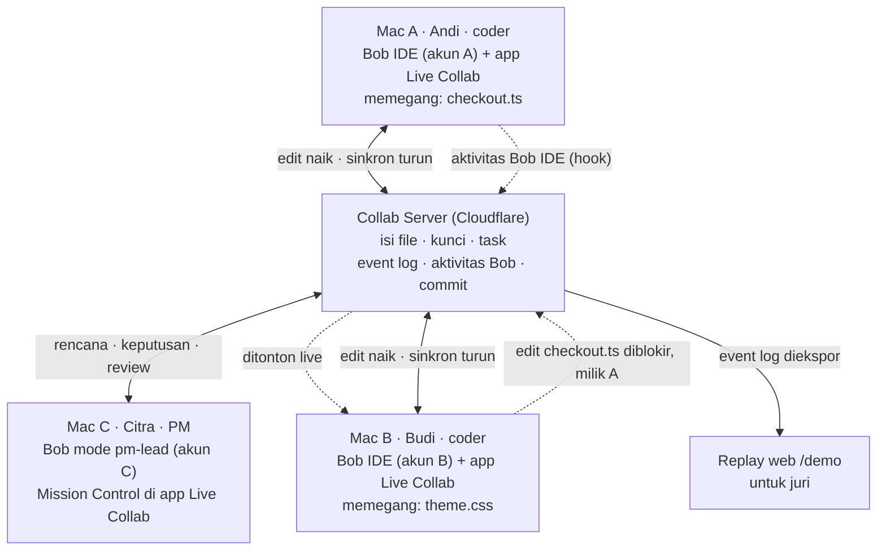

Semua perubahan lewat server, jadi server selalu tahu isi terbaru setiap file dan siapa pemegang kuncinya. PM tidak menulis kode. Ia hanya membaca dan memutuskan.

| Lapisan | Komponen | Isi |
|---|---|---|
| Di setiap Mac | **App Live Collab** (fork Orca, `.dmg`) | Pendamping Bob IDE: seksi sidebar **Live Collab** (Mission Control, Team, Files & locks), tonton aktivitas Bob rekan, onboarding kode undangan, dan terminal dengan **IBM Bob Shell** sebagai agent (opsional). App menjalankan sync agent sebagai child process. |
| Di setiap Mac | **Sync agent + kit `.bob/`** | Sync agent memantau folder proyek dan menyinkronkan perubahan dua arah. Kit `.bob/` berisi mode `coder` dan `pm-lead`, hook, dan server MCP `radar-mcp`. Kit yang sama dipakai Bob IDE dan Bob Shell. |
| Di cloud | **Collab Server** | Pusat kebenaran: isi file terbaru, kunci, task, antrean permintaan, dan event log. Menyiarkan aktivitas Bob (dari hook) ke anggota tim, dan me-relay frame terminal Bob Shell yang dibagikan (P1). Membuat commit Git otomatis setiap task disetujui. |
| Di web | **Replay `/demo`** | Juri menonton sesi nyata yang diputar ulang, tanpa login dan tanpa API key, lengkap dengan panel "Bob inside". |

---

## 03. Masalah & posisi

| Temuan | Angka | Sumber |
|---|---|---|
| Pasangan PR dari agent berbeda yang berkonflik (33.596 PR, 2.807 repo) | **41,7%** (agent yang sama: 19,8%) | [arXiv 2607.04697](https://arxiv.org/html/2607.04697v2) |
| Waktu review PR dan ukuran PR di tim yang memakai AI | review +91%, ukuran +154% | [Faros AI](https://www.faros.ai/blog/ai-software-engineering) |
| Developer yang bilang agent konsisten mengikuti standar tim | 35% | [Qodo 2026](https://www.qodo.ai/blog/state-of-ai-code-quality-report-2026/) |
| Fitur tim di Bob saat ini | seats, billing, Bobalytics. Belum ada sesi bersama atau koordinasi antar-developer. | [Bob docs](https://bob.ibm.com/docs/ide/features/bobalytics) |
| Arah roadmap IBM | "multiple agents coordinate on a single task" | [Bob V2 blog](https://bob.ibm.com/blog/bob-v2-release-announcement/) |

### Dibanding alat yang ada

| Kemampuan | Git + PR | Live Share / Replit | MCP Agent Mail | Clash | Amoeba | Mosaic | **IBM Bob Live Collab** |
|---|---|---|---|---|---|---|---|
| Perubahan terlihat live di PC lain | tidak | ya (manusia) | tidak | tidak | ya (diff sesi) | tidak (handoff async) | **ya (AI dan manusia, sampai ke disk)** |
| Kunci file untuk AI agent | tidak | tidak | sinyal saja | tidak | saran saja | tidak | **ditegakkan di hook + server** |
| Lintas developer/mesin | ya, tapi terlambat | ya | ya | tidak | ya | ya | **ya** |
| Pembagian kerja di awal | manual | tidak | tidak | tidak | rencana bersama | tidak | **main agent + PM** |
| Review sebelum commit | PR manual | tidak | tidak | tidak | gerbang persetujuan | tidak | **main agent + PM, per task** |
| Lihat agent rekan bekerja live | tidak | terminal bersama (manusia) | tidak | tidak | lane live | ya (terminal bersama) | **ya: stream aktivitas Bob IDE dari hook (P0), terminal Bob Shell (P1)** |
| Mendukung IBM Bob | – | – | umum | Claude Code | Claude Code, Codex | Claude Code, Cursor | **native: hook, custom mode, MCP Bob** |

Sumber pembanding: [MCP Agent Mail](https://github.com/Dicklesworthstone/mcp_agent_mail), [Clash](https://github.com/clash-sh/clash), [Amoeba](https://useamoeba.com/blog/multiplayer-coding-with-ai-agents), [Mosaic](https://mosaic.inc/install).

---

## 04. Tujuan, non-tujuan & metrik

**Tujuan**

1. Semua anggota tim melihat perubahan yang dibuat AI siapa pun secara live.
2. Dua AI tidak pernah menulis file yang sama pada waktu yang sama.
3. Rebutan file dicegah sejak perencanaan, dan kalau tetap terjadi, diselesaikan lewat keputusan PM.
4. Setiap task di-review sebelum masuk Git, dengan jejak siapa mengubah apa.

**Non-tujuan (MVP)**

- Dua orang mengetik di baris yang sama (CRDT ala Google Docs). Tidak dibutuhkan karena satu file satu penulis.
- File biner, `node_modules`, dan isi `.gitignore`.
- Banyak repo sekaligus, atau lebih dari 5 anggota.
- Chat tim, SSO/OAuth, dan agent selain Bob.

### Metrik keberhasilan

| Metrik | Target hackathon | Cara ukur |
|---|---|---|
| Latensi sinkron: edit tersimpan di PC A sampai muncul di disk PC B (p95) | < 1 detik | Timestamp di event log |
| Dua penulis di file yang sama pada waktu yang sama | 0 (dijamin oleh desain) | Audit event log |
| Latensi cek kunci di hook `PreToolUse` (p95) | < 300 ms | Log waktu di hook |
| Waktu sampai kedua task ter-merge dan test lulus, dan build rusak setelah merge (eksperimen 6 task) | Build rusak: 0 dengan Live Collab. Waktu: dilaporkan apa adanya, termasuk kalau lebih lambat. | Eksperimen A/B, lihat §17 |
| Waktu dari blokir sampai keputusan PM | < 60 detik di demo | Event `request.created` → `request.decided` |
| Masalah antar-file yang ditangkap review main agent | minimal 1 di demo | Event `review.flagged` |
| Kelengkapan bukti Bob | 100% Bob slice punya ekspor `.md` + screenshot ringkasan task, dari **keempat** anggota | `pnpm -C radar evidence:check` |
| Latensi stream aktivitas Bob: hook terpicu di laptop A sampai tampil di laptop B (p95) | < 1 detik | Timestamp `bob.activity` |
| Waktu pasang dari `.dmg` sampai workspace tersinkron | < 3 menit | Stopwatch saat gladi |

---

## 05. Peran & hak akses

Konfigurasi demo: tiga peran dengan tiga akun Bob, **semuanya di Bob IDE** (orang keempat tim merekam dan menonton aktivitas Bob rekan). A (Andi) dan B (Budi) adalah coder, C (Citra) adalah PM. Setiap orang memakai Bob-nya sendiri dengan mode yang berbeda. A, B, dan C memakai **Bob IDE** sebagai tempat kerja utama, dan app Live Collab dibuka di samping sebagai panel tim.

| Peran | Siapa | Deskripsi |
|---|---|---|
| **Coder** | A dan B | Memberi prompt ke Bob untuk mengerjakan task yang dibagikan. Bob mereka berjalan dalam mode `coder`. Menulis hanya file yang dialokasikan atau yang bebas, melihat perubahan rekan secara live, dan mengajukan task selesai untuk di-review. |
| **PM + main agent** | C | Mengawasi seluruh pekerjaan dari Mission Control. Bob milik C adalah main agent dalam mode `pm-lead`, dan tidak bisa mengedit kode. Main agent mengusulkan rencana, keputusan, dan hasil review. C menyetujui atau menolak lewat tombol di Mission Control. |
| **Penonton** | Juri | Membuka URL demo sendirian, tanpa Bob dan tanpa tim. Replay mode tanpa login dan tanpa API key, dengan link ke repo dan `bob_sessions/`. |

### Matriks hak akses

| Aksi | Bob coder | Coder (manusia) | Main agent | PM (manusia) |
|---|:---:|:---:|:---:|:---:|
| Membaca semua file | ya | ya | ya | ya |
| Menulis file miliknya atau file bebas | ya | ya | tidak | tidak |
| Menulis file yang dikunci orang lain | tidak | tidak | tidak | tidak |
| Membuat rencana task dan alokasi file | tidak | tidak | usul | setujui |
| Memutuskan rebutan file | minta | minta | usul | setujui |
| Me-review task dan menyetujui commit | tidak | tidak | usul | setujui |
| Mencabut kunci secara paksa | tidak | tidak | tidak | ya |

> **Prinsip governance:** main agent tidak bisa menyetujui usulannya sendiri. Tool MCP-nya hanya bisa membuat usulan. Persetujuan hanya bisa datang dari tombol di Mission Control, yang ditekan manusia.

---

## 06. Konsep inti & aturan kunci

| Konsep | Arti |
|---|---|
| **Workspace** | Satu salinan proyek yang sama di setiap PC, disinkronkan oleh server. Sumber kebenarannya ada di server. |
| **Task** | Satu unit kerja dengan judul, deskripsi, pemilik (coder), dan daftar file yang dialokasikan. |
| **Alokasi** | File yang dipesan untuk sebuah task saat rencana disetujui. Orang lain tidak bisa menulisnya. |
| **Kunci** | Hak menulis sebuah file. Pemegangnya adalah pasangan coder + task. |
| **Permintaan** | Dibuat otomatis saat Bob coder diblokir. Masuk ke antrean keputusan PM. |

### Aturan kunci

1. **Dipesan saat rencana disetujui.** File yang dialokasikan ke task berstatus *dipesan* untuk pemilik task itu.
2. **Diambil saat edit pertama.** Hook `PreToolUse` mengubah status *dipesan* menjadi *dipegang*. File yang tidak dialokasikan ke siapa pun dan masih bebas langsung diberikan ke coder yang pertama menulisnya.
3. **Dipegang sampai task disetujui.** Kunci tidak dilepas setelah setiap edit, dan juga tidak saat Bob selesai menjawab satu prompt. Kunci dilepas saat task disetujui PM. Kalau dilepas lebih awal, dua AI bisa bergantian menyelipkan perubahan ke file yang sama.
4. **Membaca selalu bebas.** Yang dikunci hanya hak menulis.
5. **Manusia ikut aturan yang sama.** Kalau coder mengetik manual di file milik orang lain, sync agent menolak perubahan itu, mengembalikan isi file dari server, dan memberi tahu coder tersebut.
6. **Antrean per file.** Kalau dua task butuh file yang sama, PM memutuskan urutannya. Saat task pertama disetujui, kunci pindah ke task berikutnya di antrean.
7. **Kunci punya batas hidup.** Sync agent mengirim heartbeat setiap 15 detik. Kalau PC pemegang kunci tidak terdengar selama 5 menit, PM mendapat peringatan dan bisa mencabut kuncinya.

### Hasil cek di hook `PreToolUse`

| Kondisi file | Hasil | Aksi |
|---|---|---|
| Dipesan atau dipegang oleh task saya | 🟢 izinkan | exit 0. Status menjadi *dipegang* kalau belum. |
| Bebas, tidak dialokasikan ke siapa pun | 🟢 izinkan + ambil | exit 0. Kunci diberikan ke task aktif saya, dan main agent diberi tahu. |
| Dipesan atau dipegang orang lain | 🔴 blokir | exit 2. Permintaan dibuat otomatis dan masuk ke antrean PM. |
| Server tidak menjawab dalam 1,5 detik | 🟡 izinkan (fail-open) | exit 0 dan dicatat. Sync agent tetap menolak di sisi server kalau file ternyata milik orang lain. |

> **Dua lapis penegakan.** Hook mencegah Bob menulis. Sync agent dan server menjadi lapis kedua: server menolak setiap update ke file yang bukan milik pengirimnya. Lapis kedua ini juga menangkap edit yang lolos dari hook, misalnya lewat perintah shell (`sed -i`) atau ketikan manual.

---

## 07. User flow

### 7.1 Satu sesi tim dari awal sampai akhir

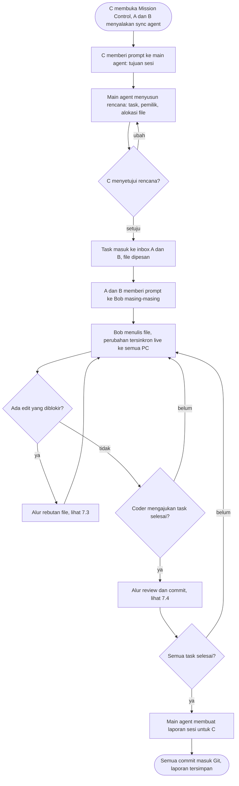

Rebutan file dan review adalah dua titik di mana PM terlibat. Di luar itu, coder bekerja paralel tanpa menunggu.

### 7.2 Coder bekerja dengan Bob

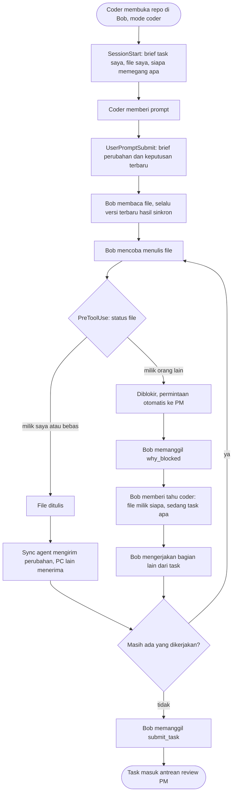

Bob coder tidak pernah mencoba ulang edit yang diblokir. Keputusan PM sampai ke Bob lewat brief di prompt berikutnya.

### 7.3 Rebutan file

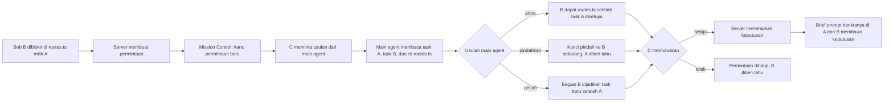

Usulan "antre" boleh diterapkan otomatis tanpa klik PM, karena tidak mengambil apa pun dari siapa pun. Pemindahan kunci selalu butuh persetujuan PM.

### 7.4 Review dan commit

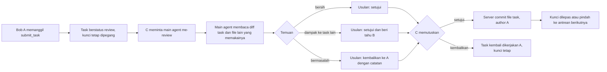

Karena setiap file hanya dipegang satu task, commit per task selalu bersih: server cukup meng-commit file milik task itu.

### 7.5 Coder mengetik manual di file milik orang lain

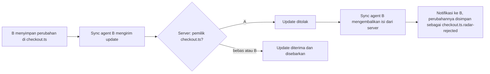

Perubahan yang ditolak tidak dibuang. Isinya disimpan di file sampingan supaya coder bisa menyalinnya nanti.

### 7.6 Juri menonton demo

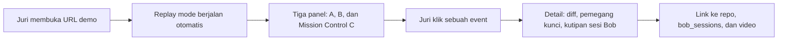

---

## 08. Alur sistem

### 8.1 Edit live dan blokir

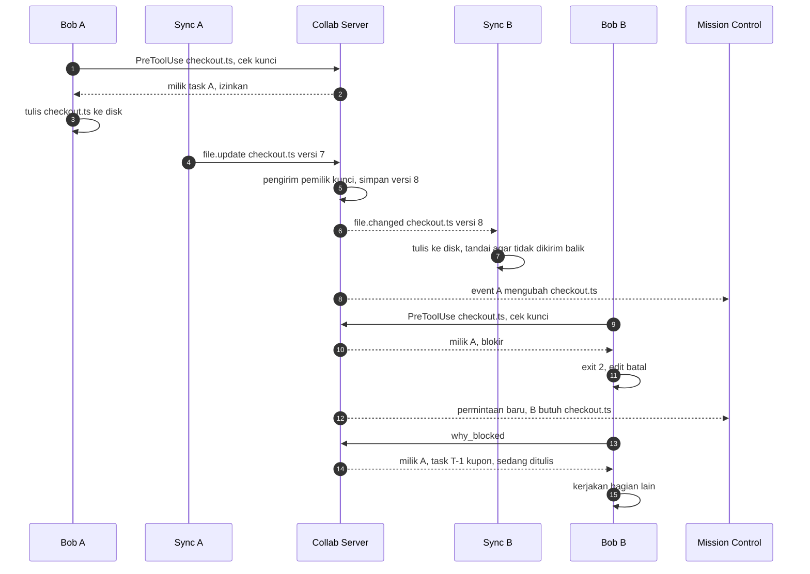

Langkah 4 sampai 7 adalah sinkronisasi live. Langkah 9 sampai 13 adalah blokir. Server memeriksa pemilik kunci dua kali: saat hook bertanya, dan saat update file masuk.

### 8.2 Keputusan PM

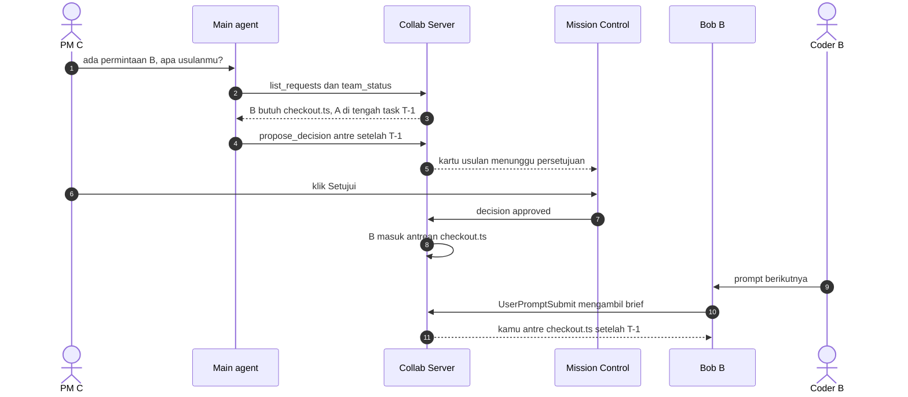

Persetujuan hanya lewat Mission Control (langkah 6). Main agent tidak punya tool untuk menyetujui usulannya sendiri.

### 8.3 Mekanisme sinkron

- **Deteksi perubahan:** sync agent memantau folder proyek, mengabaikan `.git/`, `node_modules/`, isi `.gitignore`, dan file di atas 1 MB. Perubahan ditunda 150 ms untuk menggabungkan beberapa simpanan beruntun.
- **Kirim isi utuh, bukan diff.** Setiap update berisi path, versi dasar, isi file, dan hash. Untuk repo kecil ini paling sederhana dan paling andal.
- **Server memeriksa pemilik.** Update diterima kalau pengirim memegang kunci, atau file bebas. Versi naik satu, lalu perubahan disebarkan ke semua PC lain.
- **Mencegah gema.** Saat sync agent menulis file kiriman server, ia mencatat hash-nya. Event pemantau untuk hash itu diabaikan, supaya file tidak dikirim balik dan berputar tanpa henti.
- **Bergabung dan tersambung ulang.** PC baru mengunduh snapshot seluruh workspace. PC yang terputus mengirim ulang perubahannya saat tersambung. Kalau versinya sudah tertinggal, server yang menang dan isi lokal disimpan sebagai `.radar-conflict`.
- **Hapus dan ganti nama** dikirim sebagai `file.deleted`, dan ganti nama dianggap hapus lalu buat. Keduanya juga butuh kunci.

---

## 09. Siklus hidup

### Siklus kunci sebuah file

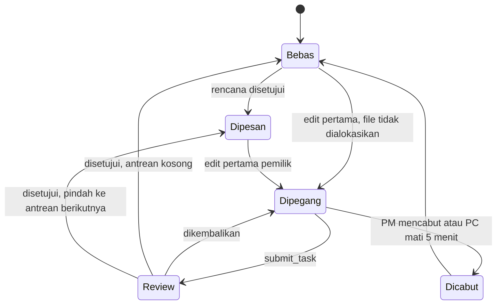

### Siklus sebuah task

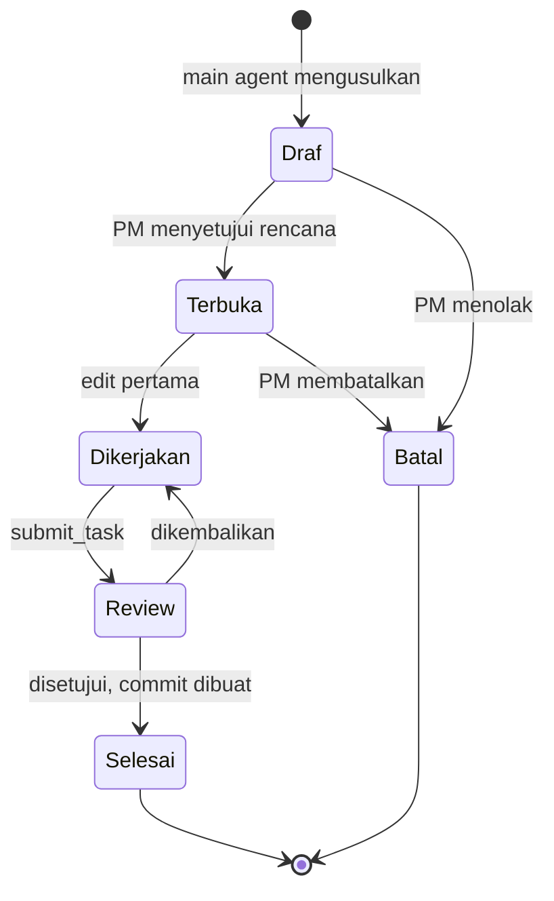

---

## 10. Requirement fungsional

**P0** wajib untuk demo. **P1** dikerjakan kalau P0 selesai sebelum Sabtu 23:00 WITA. **P2** masuk roadmap di deck.

### 10.1 Sync agent

| ID | Requirement | Kriteria penerimaan | Prioritas |
|---|---|---|---|
| SY-01 | Bergabung ke workspace | `radar join <workspace> --as A` mengunduh snapshot dan mulai memantau folder. | P0 |
| SY-02 | Kirim perubahan lokal | File teks yang disimpan terkirim dalam < 300 ms setelah jeda 150 ms. | P0 |
| SY-03 | Terima perubahan dari server | File ditulis ke disk dan tidak dikirim balik (pencegahan gema berbasis hash). | P0 |
| SY-04 | Tolak update ke file milik orang lain | Isi dikembalikan dari server, perubahan lokal disimpan ke `.radar-rejected`, notifikasi tampil. | P0 |
| SY-05 | Heartbeat | Setiap 15 detik ke server. | P0 |
| SY-06 | Hapus dan ganti nama | Tersinkron ke PC lain, dan butuh kunci. | P1 |
| SY-07 | Tersambung ulang | Perubahan saat offline dikirim ulang. Kalau versi tertinggal, isi lokal disimpan ke `.radar-conflict`. | P1 |

### 10.2 Collab Server: file, kunci, task

| ID | Requirement | Kriteria penerimaan | Prioritas |
|---|---|---|---|
| SV-01 | Simpan isi file terbaru dengan nomor versi | Setiap update yang diterima menaikkan versi dan disebarkan ke semua klien lain lewat WebSocket. | P0 |
| SV-02 | Cek kunci untuk hook | `POST /v1/locks/check` mengembalikan izinkan/blokir sesuai tabel §06. p95 < 300 ms. | P0 |
| SV-03 | Tolak update dari bukan pemilik | Update ke file milik orang lain dijawab `rejected`, tanpa mengubah isi. | P0 |
| SV-04 | Rencana dan alokasi | Rencana yang disetujui membuat task dan memesan file sesuai alokasi. | P0 |
| SV-05 | Permintaan otomatis saat blokir | Setiap blokir membuat satu permintaan (tidak duplikat untuk file dan task yang sama). | P0 |
| SV-06 | Antrean per file | Saat task disetujui, kunci pindah ke task berikutnya di antrean dan pemiliknya diberi tahu. | P0 |
| SV-07 | Commit per task | Saat review disetujui, server meng-commit file milik task dengan author coder, trailer `Co-authored-by: IBM Bob`, `Radar-Task`, dan `Reviewed-by`, lalu push ke GitHub. | P0 |
| SV-08 | Event log | Setiap kejadian tercatat dan bisa diekspor sebagai JSON untuk replay. | P0 |
| SV-09 | Kunci kedaluwarsa | Tanpa heartbeat 5 menit, PM diberi peringatan dan bisa mencabut kunci. | P1 |
| SV-10 | Pemicu main agent otomatis | Setiap permintaan baru menjalankan `bob run --mode pm-lead` (Bob Shell, dengan batas biaya bila CLI mendukungnya) di PC C untuk membuat usulan. Hanya R1: di R0 PM memanggil main agent manual di Bob IDE. | P1 |

### 10.3 Integrasi Bob untuk coder

| ID | Requirement | Kriteria penerimaan | Prioritas |
|---|---|---|---|
| BC-01 | Custom mode `coder` | Bob mulai dengan `my_tasks`. Setelah diblokir, Bob memanggil `why_blocked`, tidak mencoba ulang, dan tidak mengedit lewat shell. Saat selesai, Bob memanggil `submit_task`. | P0 |
| BC-02 | Hook `SessionStart` | Mencetak brief paling banyak 6 baris: task saya, file saya, siapa memegang apa. | P0 |
| BC-03 | Hook `UserPromptSubmit` | Menyisipkan keputusan PM dan pemberitahuan baru sejak prompt terakhir, termasuk file yang baru diubah rekan. | P0 |
| BC-04 | Hook `PreToolUse` untuk `^(write_file\|apply_diff\|search_and_replace\|insert_content\|office_edit)$` | Payload dinormalisasi dari dua bentuk (`event/tool/input` dan `hook_event_name/tool_name/tool_input`). Blokir menghasilkan exit 2 dan file tidak berubah. | P0 |
| BC-05 | Hook `PostToolUse` | Menandai perubahan sebagai buatan AI (bukan ketikan manusia) di event log (`file_version.ai`). Catatan: hook `PostToolUse` yang sama sudah mengirim `bob.activity kind=tool.post` sebagai bagian JT-01 (P0); yang P1 hanya penanda AI. | P1 |
| BC-06 | Hook `Stop` | Mengirim `bob.activity kind=turn.end` (akhir giliran). **Tanpa ringkasan**: menurut docs, payload `Stop` hanya berisi session ID. Tidak melepas kunci. Sinyal akhir giliran adalah bagian JT-01 (P0); ringkasan giliran di luar lingkup. | P0 (lewat JT-01) |
| BC-07 | Tool MCP coder | `my_tasks`, `why_blocked`, `request_file`, `team_activity`, `submit_task` berfungsi. | P0 |

### 10.4 Main agent (Bob milik PM)

| ID | Requirement | Kriteria penerimaan | Prioritas |
|---|---|---|---|
| MA-01 | Custom mode `pm-lead` tanpa hak edit | Mode hanya punya grup tool baca dan MCP. Bob tidak bisa menulis file walaupun diminta. | P0 |
| MA-02 | Menyusun rencana | Dari satu tujuan, main agent memanggil `propose_plan` dengan task, pemilik, dan alokasi file tanpa file yang tumpang tindih. Kalau tidak bisa dihindari, file bersama ditandai antre. | P0 |
| MA-03 | Menengahi rebutan | `list_requests` lalu `propose_decision` dengan pilihan antre, pindahkan, atau pecah, disertai alasan. | P0 |
| MA-04 | Review task | `get_task_diff` mengembalikan diff task dan daftar file task lain yang meng-import file yang berubah. Main agent memanggil `propose_review` dengan status setujui, setujui dan beri tahu, atau kembalikan. | P0 |
| MA-05 | Pemberitahuan ke coder | `notify(dev, pesan)` muncul di brief prompt berikutnya milik coder itu. | P0 |
| MA-06 | Laporan sesi | `session_report` menghasilkan ringkasan: task, commit, blokir, keputusan, dan waktu. | P1 |
| MA-07 | Tidak bisa menyetujui diri sendiri | Tidak ada tool MCP untuk menyetujui. Semua endpoint persetujuan hanya menerima token Mission Control. | P0 |

### 10.5 Mission Control (di app desktop) dan replay (web)

Mission Control kini menjadi view di app Live Collab (seksi sidebar **Live Collab**), bukan halaman web. Komponennya ada di `@radar/ui` dan dipakai bersama oleh app dan replay web. Desain lengkap: [`DESIGN.md`](DESIGN.md) §5.

| ID | Requirement | Kriteria penerimaan | Prioritas |
|---|---|---|---|
| UI-01 | Task board | Kolom Draf, Dikerjakan, Review, Selesai. Kartu menampilkan pemilik dan jumlah file. | P0 |
| UI-02 | Pohon file dengan kunci | Setiap file menampilkan chip pemegang (warna per orang), status dipesan/dipegang/review, dan penanda "sedang ditulis" selama 3 detik setelah update. | P0 |
| UI-03 | Antrean keputusan | Usulan rencana, keputusan rebutan, dan review tampil sebagai kartu dengan tombol Setujui dan Tolak. Kartu menyebut "diusulkan pm-lead · disetujui <manusia>". | P0 |
| UI-04 | Feed live | Event muncul < 1 detik setelah terjadi. Event yang berasal dari primitif Bob menampilkan jejak `BobTrace` (hook/MCP/mode). | P0 |
| UI-05 | Replay di `/demo` (web) | Memutar event log + aktivitas Bob dari file JSON statis, tanpa login dan tanpa API key. Ada panel **Bob inside** yang menunjukkan primitif Bob per event dan link ke `bob_sessions/`. | P0 |
| UI-06 | Diff viewer | Klik file atau event menampilkan diff terakhir. | P1 |
| UI-07 | Tampilan coder | Panel Team + Notifications di app: task saya, file saya, siapa memegang apa, notifikasi. | P0 (murah karena memakai komponen UI-02/04) |
| UI-09 | Landing page web (Application URL) | `/` statis: tombol **Watch the live replay** (`/demo`), **Download for macOS** (Release `.dmg`), langkah pasang, link repo/bob_sessions/video/deck. Tanpa login. | P0 |
| UI-08 | Tag agent live di editor | Baris yang baru ditulis Bob rekan diberi pill `Andi · Bob coder` selama 3 detik (dekorasi Monaco). | P1 |

### 10.6 App desktop IBM Bob Live Collab (fork Orca)

| ID | Requirement | Kriteria penerimaan | Prioritas |
|---|---|---|---|
| DA-01 | Build `.app`/`.dmg` macOS | `pnpm -C app build` + `electron-builder --mac dmg` dengan `CSC_NAME=-` (ad-hoc; **bukan** `build:mac`, karena skrip itu ikut membangun helper Computer Use yang butuh signing identity) menghasilkan `IBM Bob Live Collab.dmg` yang bisa dipasang di Mac lain (arm64). Tidak di-sign Developer ID/notarize. Cara buka (Privacy & Security → Open Anyway, atau `xattr`) dijelaskan di README. | P0 |
| DA-02 | IBM Bob (Shell) sebagai agent Orca | "IBM Bob" muncul di pemilih agent. Memilihnya menjalankan `bob` di terminal worktree. Glyph generik "B", bukan logo IBM. Tombol **Open in Bob IDE** membuka folder workspace di Bob IDE. | P1 (Bob IDE tetap alat utama) |
| DA-03 | Seksi sidebar Live Collab | Item Mission Control, Team, Files & locks, dengan badge jumlah "Needs you". | P0 |
| DA-04 | Koneksi Live Collab | Settings → Live Collab: URL server + token (atau kode undangan). Status koneksi tampil di status bar. Token disimpan di storage aman Electron (`safeStorage`), tidak di repo. | P0 |
| DA-05 | Supervisor sync agent | App menjalankan `radar start` untuk workspace aktif sebagai child process, me-restart kalau mati, dan menampilkan log ringkas. | P1 (P0 cukup `radar join` di terminal) |
| DA-06 | Atribusi Orca | README, layar About, dan `LICENSE` menyebut IBM Bob Live Collab sebagai fork Orca (MIT). | P0 |

### 10.7 Tonton Bob rekan

| ID | Requirement | Kriteria penerimaan | Prioritas |
|---|---|---|---|
| JT-01 | Stream aktivitas Bob IDE | Hook di kit coder mengirim `POST /v1/bob/activity` (fire-and-forget, ≤ 800 ms) untuk `UserPromptSubmit` (ringkasan prompt ≤ 200 karakter), `PreToolUse` (tool + path + hasil cek kunci), `PostToolUse` (tool + path + ukuran perubahan), dan `Stop` (akhir giliran). Server menyiarkan event `bob.activity`. | P0 |
| JT-02 | Tampilan "Watching Andi's Bob" | Dari panel Team, klik anggota → timeline live aktivitas Bob-nya (prompt, baca/tulis file, blokir, giliran selesai) dengan border warna pemilik dan jejak primitif (`hook · PreToolUse`, `mcp · radar.why_blocked`, mode). p95 < 1 detik. | P0 |
| JT-03 | Privasi prompt | Setiap anggota memilih "share my prompts" (default **on** untuk demo; bisa dimatikan, lalu hanya aktivitas tool yang dibagikan). Isi file tidak pernah ikut di aktivitas, cukup path + jumlah baris. | P0 |
| JT-04 | Tonton terminal Bob Shell | Kalau anggota memakai Bob Shell di terminal app, tombol **Share** mengirim `term.frame`, dan anggota lain menonton read-only (relay R3 §3.9). | P1 |
| JT-05 | Ketik sebagai tamu | Seperti v0.3 awal: izin host 10 menit, label nama tamu. | P2 |

### 10.8 Onboarding, distribusi & bukti Bob

| ID | Requirement | Kriteria penerimaan | Prioritas |
|---|---|---|---|
| IN-01 | CLI `radar` terpasang dari rilis | `npm i -g <url tarball rilis>` memasang `radar`. `radar join` jalan seperti di v0.2. | P0 |
| IN-02 | Kode undangan | `pnpm -C radar admin invite --member B` mencetak `rdr_inv_…`. App dan CLI menerima kode itu. | P1 |
| IN-03 | Checklist onboarding | App mengecek: `bob` CLI ada, kit `.bob/` terpasang, hook terdaftar, `radar-mcp` bisa dijalankan, file tersinkron. Item gagal diberi satu kalimat perbaikan. | P1 |
| IN-04 | Installer satu baris | `curl -fsSL <domain>/install \| sh` memasang CLI dan membuka unduhan `.dmg`. | P2 |
| EV-01 | Folder bukti per anggota | `bob_sessions/<tim>_<nama>_task<NN>_<slug>_summary.png` (+ `.md` ekspor) untuk setiap Bob slice. `bob_sessions/INDEX.md` terisi. | P0 |
| EV-02 | Script bukti | `radar/scripts/bob-evidence.sh <nama> <NN> <slug>` mengambil screenshot jendela Bob IDE secara otomatis (fallback `--interactive` = `screencapture -i`), memindahkan ekspor `.md` terbaru dari `~/Downloads`, dan menambah baris ke `bob_sessions/index/<nama>.md` (R7). `INDEX.md` dirakit di fase 14. | P0 |
| EV-03 | Trailer commit | Commit berisi kode hasil Bob memakai trailer `Bob-Assisted: bob_sessions/<png>`. `evidence:check` memverifikasi setiap trailer menunjuk ke folder yang ada, dan setiap anggota punya ≥ 3 slice. | P0 |

---

## 11. Layar

Desain lengkap, token warna, komponen, dan wireframe tiap layar ada di [`DESIGN.md`](DESIGN.md). Prompt untuk men-generate mockup ada di [`prompt_ui.md`](prompt_ui.md). Ringkasan:

| Layar | Siapa | Isi utama | DESIGN.md |
|---|---|---|---|
| Home · Workspaces | semua | kartu workspace dengan status "Needs you", Bob mode aktif, anggota online | §5.1 |
| Workspace · coder | A, B | **Bob IDE** (chat Bob, jejak hook) di samping app Live Collab: explorer dengan chip kunci, panel Team + Notifications | §5.2 |
| Mission Control | C (PM) | Tasks · Files & locks · Needs you (kartu keputusan & review) · Live feed | §5.3 |
| Momen near-miss | semua | blokir di Bob IDE Budi (chat + timeline aktivitas) → kartu keputusan di layar Citra → Approve → brief di prompt berikutnya | §5.4 |
| Review & commit | C | diff ringkas, dampak antar-file, verdict main agent, Approve & commit | §5.5 |
| Tonton Bob rekan | semua | timeline live aktivitas Bob IDE rekan (prompt, file, blokir), border warna pemilik | §5.6 |
| Ketik sebagai tamu (P1) | semua | izin host, label nama tamu di baris input | §5.7 |
| Replay `/demo` (web) | juri | 3 kolom A · MC · B, timeline chapter, panel "Bob inside", counter | §5.8 |
| Onboarding | semua | tempel kode undangan → checklist Bob CLI/kit/hook/MCP/sync | §5.9 |

### Prinsip UX

- **Bob selalu kelihatan.** Setiap aksi menyebut Bob siapa dan primitif Bob apa yang bekerja (`hook · PreToolUse · lock_guard → blocked · 84 ms`).
- **Coder tidak pernah menunggu tanpa pekerjaan.** Setiap blokir disertai arahan ke bagian lain dari task.
- **PM melihat ringkasan dulu, detail kemudian.** Kartu keputusan selalu berisi usulan main agent dan alasannya dalam satu kalimat.
- **Brief yang hemat.** Semua teks yang disisipkan ke konteks Bob dibatasi 6 baris, karena setiap karakter memakan Bobcoin.
- **Warna per orang konsisten** di semua layar: A biru `#78A9FF`, B ungu `#BE95FF`, C oranye `#FF832B`. Merah, kuning, hijau hanya untuk status.

---

## 12. Arsitektur

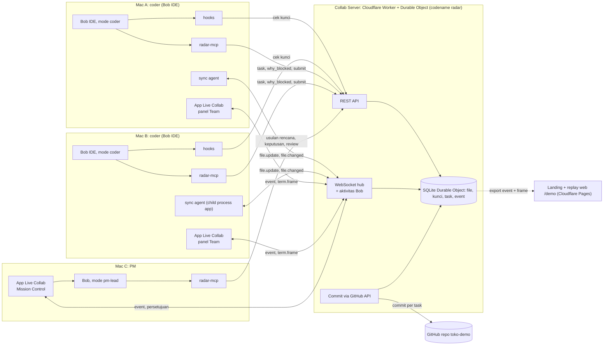

Hook dan tool MCP memakai REST karena singkat dan sinkron. Sync agent dan app memakai WebSocket karena butuh dorongan dari server. Frame terminal hanya lewat WebSocket dan tidak disimpan, kecuali saat mode rekam demo.

### Stack

| Bagian | Pilihan | Alasan |
|---|---|---|
| App desktop | **Fork Orca** (Electron 43, electron-vite, React, zustand, xterm, Monaco), MIT | Sudah punya terminal agent, worktree, board, editor. Kita menambah agent `bob` dan panel Live Collab saja. |
| Kode Live Collab | TypeScript di Node 24, workspace pnpm **terpisah** di `radar/` (seperti `mobile/` di Orca). Bundle hook & radar-mcp ditarget `node20`. | Tidak menyentuh graph paket Orca |
| Komponen UI bersama | `@radar/ui` (React), diimpor app lewat alias Vite dan dipakai web replay | Satu set komponen untuk app dan replay |
| Sync agent | CLI Node: `chokidar` + `ws` | Pemantau file yang matang di semua OS |
| Server | **Cloudflare Workers + Durable Objects** (Hono, WebSocket Hibernation API, SQLite bawaan DO), commit lewat **GitHub Git Data API** (`fetch` langsung, alur dua transaksi R4 §6.3). Plan Workers Free. | Serverless tapi stateful: satu DO per workspace menahan semua WebSocket dan memproses pesan satu per satu (cek kunci bebas race), URL tetap, gratis, dan tidak ada mesin yang harus dijaga. Lokal: `wrangler dev`. |
| Hook | Script Node kecil yang dibundel esbuild | Jalan di Bob IDE (komponen inti; Bob Shell opsional) tanpa `npm install` |
| radar-mcp | MCP TypeScript SDK, transport stdio | Dipakai mode `coder` dan `pm-lead` |
| Landing + replay web | Next.js (`output: 'export'`) di **Cloudflare Pages**, statis | Tetap hidup walaupun server mati. Satu akun Cloudflare dengan server. |
| Cara membangun | Claude Code + plugin **ECC** (planner, tdd-guide, code-reviewer, security-reviewer) + **IBM Bob IDE** untuk Bob slice | Lihat [`PLAN.md`](PLAN.md) §4 dan §7 |

---

## 13. Data, API & konfigurasi

### Model data

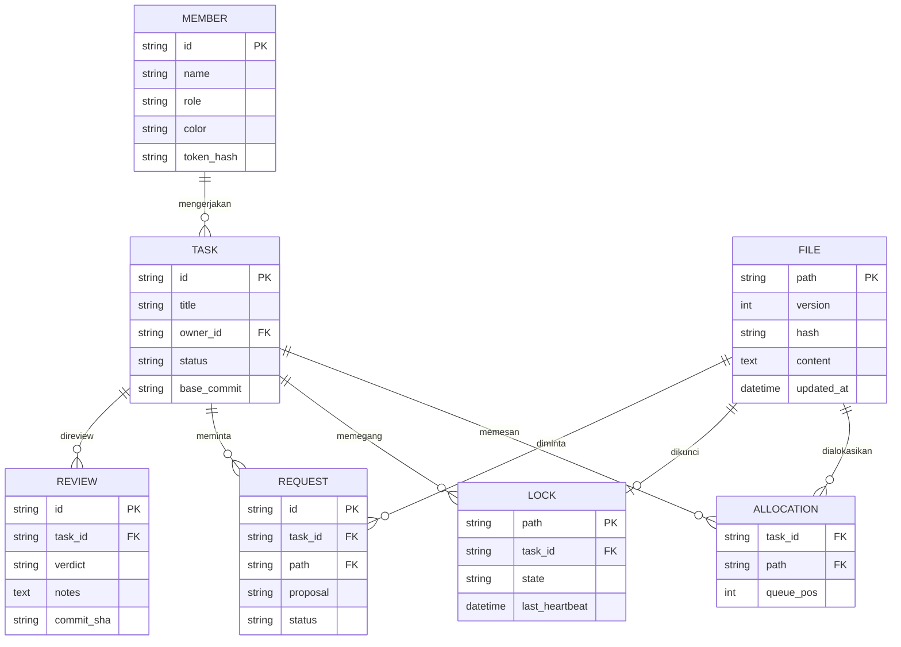

Tabel `event` (id, ts, actor, type, payload) tidak digambar. Setiap perubahan di tabel lain juga ditulis ke sana sebagai sumber feed dan replay.

### REST API

| Metode | Path | Dipanggil oleh | Fungsi |
|---|---|---|---|
| POST | `/v1/locks/check` | Hook PreToolUse | Izinkan atau blokir. Otomatis mengambil kunci file bebas. Otomatis membuat permintaan saat blokir. |
| GET | `/v1/brief?member=&since=` | Hook SessionStart, UserPromptSubmit | Brief pendek: task, kunci, keputusan, pemberitahuan |
| GET | `/v1/tasks?owner=` | MCP `my_tasks` | Task milik coder beserta alokasi file |
| GET | `/v1/blocks/last?member=` | MCP `why_blocked` | Pemilik file, task-nya, dan saran |
| POST | `/v1/tasks/{id}/submit` | MCP `submit_task` | Task masuk review |
| POST | `/v1/proposals` | MCP main agent | Usulan rencana, keputusan, atau review. Status selalu *menunggu*. |
| GET | `/v1/tasks/{id}/diff` | MCP `get_task_diff` | Diff sejak `base_commit` + file lain yang meng-import file yang berubah |
| POST | `/v1/proposals/{id}/decision` | Mission Control saja | Setujui atau tolak. Butuh token Mission Control. |
| GET | `/v1/events/export` | Tim | JSON untuk replay |

### Pesan WebSocket

| Pesan | Arah | Isi |
|---|---|---|
| `hello` | klien → server | member, token, peran |
| `snapshot` | server → klien | semua file + versi, saat bergabung |
| `file.update` | sync agent → server | path, base_version, content, hash |
| `file.changed` | server → semua klien lain | path, version, content, hash, by |
| `file.rejected` | server → pengirim | path, pemilik, isi server |
| `lock.changed` | server → semua | path, state, task, antrean |
| `proposal.new` / `proposal.decided` | server → Mission Control | jenis, isi, alasan, status |
| `heartbeat` | sync agent → server | member, waktu |
| `term.share` / `term.unshare` | app host → server | termId, member, judul (mis. "Andi's Bob · coder"), cols, rows |
| `term.list` | server → app | terminal yang sedang dibagikan di workspace + jumlah penonton |
| `term.subscribe` / `term.unsubscribe` | app penonton → server | termId |
| `term.snapshot` | host → server → penonton baru | isi serialize xterm (maks 256 KB) |
| `term.frame` | host → server → penonton | termId, seq, data (base64), ts |
| `term.input.request` / `term.input.grant` / `term.input.revoke` | penonton ↔ host lewat server | termId, guest, berlaku sampai (P1) |
| `term.input` | penonton → server → host | termId, guest, data (P1). Host hanya menerima bila grant masih berlaku. |

Detail kontrak pesan `term.*` ada di `plan/ref/R3-kontrak-api.md` §3.9.

### Konfigurasi Bob

Kit yang sama dipakai **Bob IDE** dan **Bob Shell**. Keduanya membaca `.bob/settings.json` (workspace) dan `~/.bob/settings/settings.json` (global) dengan format hook yang sama. Workspace harus di-**trust** (Bob IDE ≥ 2.0.2): folder untrusted melewati hook, MCP, dan rules tanpa error. Grup shell bernama `execute` (docs custom modes). Tool MCP butuh `alwaysAllow` di `.bob/mcp.json` supaya jalan tanpa klik approve. Kanal pesan blokir dipastikan saat spike.

```yaml
# .bob/custom_modes.yaml  (nama grup tool diverifikasi saat spike)
customModes:
  - slug: coder
    name: Live Collab Coder
    roleDefinition: Kamu adalah coder di workspace multiplayer IBM Bob Live Collab.
    customInstructions: |
      1. Mulai setiap sesi dengan radar.my_tasks. Kerjakan hanya task milikmu.
      2. Kalau sebuah edit ditolak, JANGAN coba ulang dan JANGAN ubah file lewat shell.
         Panggil radar.why_blocked, beri tahu user, lalu kerjakan bagian lain.
      3. File bisa berubah karena rekan. Baca ulang file sebelum mengeditnya.
      4. Saat task selesai, panggil radar.submit_task dengan ringkasan singkat.
    groups: [read, edit, execute, mcp]
  - slug: pm-lead
    name: Live Collab PM Lead
    roleDefinition: Kamu adalah main agent yang membantu PM mengatur tim coder. Kamu tidak menulis kode.
    customInstructions: |
      1. Susun rencana dengan radar.propose_plan. Hindari file yang sama di dua task.
         Kalau tidak bisa dihindari, tandai file itu sebagai antre.
      2. Untuk rebutan file, baca kedua task lalu radar.propose_decision dengan alasan satu kalimat.
      3. Untuk review, pakai radar.get_task_diff. Cek dampak ke file task lain, lalu radar.propose_review.
      4. Semua usulan menunggu persetujuan PM di Mission Control. Kamu tidak bisa menyetujuinya.
    groups: [read, mcp]
```

```jsonc
// .bob/settings.json  (dipakai di PC coder)
{
  "hooks": {
    "SessionStart":     [{ "hooks": [{ "type": "command", "command": "node .bob/hooks/brief.js start",  "timeout": 5 }] }],
    "UserPromptSubmit": [{ "hooks": [{ "type": "command", "command": "node .bob/hooks/brief.js prompt", "timeout": 5 }] }],
    "PreToolUse": [{
      "matcher": "^(write_file|apply_diff|search_and_replace|insert_content|office_edit)$",
      "hooks": [{ "type": "command", "command": "node .bob/hooks/lock_guard.js", "timeout": 3 }]
    }],
    "PostToolUse": [{
      // tool edit + baca + perintah (JT-02); daftar final dari spike 7, tanpa tool MCP radar sendiri
      "matcher": "^(write_file|apply_diff|search_and_replace|insert_content|office_edit|read_file|execute_command)$",
      "hooks": [{ "type": "command", "command": "node .bob/hooks/mark_ai_edit.js", "timeout": 3 }]
    }],
    "Stop": [{ "hooks": [{ "type": "command", "command": "node .bob/hooks/stop.js", "timeout": 3 }] }]
  }
}
```

### Tool MCP `radar-mcp`

| Untuk coder | Untuk main agent |
|---|---|
| `my_tasks()` | `team_status()` |
| `why_blocked()` | `propose_plan(tujuan, tasks[])` |
| `request_file(path, alasan)` | `list_requests()` |
| `team_activity(path?)` | `propose_decision(request_id, antre \| pindahkan \| pecah, alasan)` |
| `submit_task(task_id, ringkasan)` | `get_task_diff(task_id)` |
| | `propose_review(task_id, verdict, catatan)` |
| | `notify(member, pesan)` |
| | `session_report()` |

---

## 14. Requirement non-fungsional

| ID | Aspek | Requirement |
|---|---|---|
| NFR-01 | Latensi | Sinkron p95 < 1 detik. Cek kunci p95 < 300 ms. Batas waktu hook 3 detik. |
| NFR-02 | Konsistensi | Server adalah satu-satunya sumber kebenaran. Setiap file punya nomor versi yang naik terus. Tidak ada dua penulis aktif untuk satu file. |
| NFR-03 | Ketersediaan | Hook fail-open kalau server tidak menjawab, dengan lapis kedua di server. Replay mode tidak bergantung pada server. |
| NFR-04 | Keamanan | Token per anggota. Endpoint persetujuan hanya menerima token Mission Control. Tidak ada secret di repo, log hook, atau `bob_sessions/`. Jalankan gitleaks di seluruh history. Hook berjalan dengan izin penuh user, dan ini diakui di deck. |
| NFR-05 | Privasi | MVP menyimpan isi file di server tim. Roadmap: server self-hosted di jaringan perusahaan. |
| NFR-06 | Biaya Bobcoin | Brief ≤ 6 baris. Main agent dipanggil hanya saat ada usulan yang dibutuhkan. Diukur dari ringkasan task Bob IDE (bukti `bob_sessions/`), bukan dari flag CLI. Pemicu otomatis (SV-10, R1) memakai batas biaya Bob Shell bila tersedia. |
| NFR-07 | Data | Repo contoh dengan data sintetis. Tidak ada data pribadi, klien, atau media sosial. |
| NFR-08 | Kompatibilitas | **Bob IDE ≥ 2.1.0** (dibutuhkan untuk `office_edit`; v1.0.3 dan v2.0.0 berhenti berfungsi 30 Sep 2026), login akun hackathon `ibm-coding-challenge-uat` (us-east), Bob Shell opsional (bukan syarat P0), Node 24 untuk membangun (bundle hook/radar-mcp jalan di Node ≥ 20), git ≥ 2.38. App desktop: **macOS arm64** (R0). Sync agent, hook, dan server: macOS, Windows, dan Linux. |
| NFR-09 | Bisa diaudit | Setiap keputusan PM, usulan main agent, commit, aktivitas Bob, dan share terminal tercatat di event log. Setiap task Bob IDE yang terkait submission punya screenshot ringkasan task di `bob_sessions/` (penamaan R7). |
| NFR-10 | Lisensi & atribusi | Fork Orca mempertahankan `LICENSE` MIT dan menyebut Orca di README dan About. Tidak memakai logo IBM. Tertulis "community hackathon project, not an official IBM product". |
| NFR-11 | Kepatuhan template IBM | Repo memuat `.gitignore`, `.bobignore`, `SECURITY.MD`, dan `.env.example` dari [ibm-hackathon-template](https://github.com/watsonxhackathon/ibm-hackathon-template), digabung dengan `.gitignore` Orca. Tidak ada nama file yang tertangkap pola template (`*token*`, `*secret*`, `*password*`, `*credentials*`, `config.json`), dan hal ini dicek di CI. |
| NFR-12 | Keamanan terminal bersama | Frame hanya dikirim ke anggota workspace yang sama. Share mati secara default. Input tamu butuh grant yang terbatas waktu. |

---

## 15. Naskah video (≤ 3 menit, ≥ 90 detik solusi berjalan)

Aturan: MP4, maksimal 3 menit (juri berhenti menonton di 3:00), minimal 90 detik menampilkan solusi berjalan di layar, ada narasi, dan jelas menunjukkan pemakaian IBM Bob. Layar dibagi tiga: Andi (Bob IDE) kiri, Mission Control Citra tengah, Budi (Bob IDE) kanan. Bob IDE harus terlihat jelas sebagai alat utama. Rekam versi terbaik Minggu 11:00–14:00 WITA (setelah GATE 2), dan rekam per layar sebagai cadangan.

| Waktu | Adegan | Detik solusi berjalan |
|---|---|---|
| 0:00–0:15 | **Hook masalah.** Dua Bob menulis `checkout.ts` yang sama dan build rusak (8 detik, dipercepat). Teks di layar: "41,7% of PR pairs from different AI agents conflict." | – |
| 0:15–0:25 | **Ide.** "IBM Bob Live Collab: Google Docs for teams on IBM Bob. Each teammate's own Bob, one live workspace." | – |
| 0:25–0:50 | **Rencana.** Di **Bob IDE**, Citra memilih mode `pm-lead` dan meminta rencana. Main agent memakai **subagent** untuk memetakan file per task. Kartu rencana muncul dan Citra Approve. Chip kunci berwarna muncul di Files & locks. | 25 |
| 0:50–1:20 | **Live.** Andi dan Budi memberi prompt ke **Bob IDE** masing-masing. File di laptop Budi berubah sendiri saat Bob Andi menulis, dengan pill `Andi · Bob coder`. Budi klik **Watch Andi's Bob** dan melihat prompt serta file yang sedang ditulis Bob Andi secara live. | 30 |
| 1:20–1:55 | **Near-miss.** Bob IDE Budi mencoba `checkout.ts` dan tool call-nya ditolak hook `PreToolUse` (terlihat di chat Bob IDE dan sebagai `hook · PreToolUse → blocked` di timeline app). Bob Budi memanggil `radar.why_blocked`, menjelaskan sendiri, lalu pindah ke `Header.tsx`. Kartu "Needs you" muncul di Citra, main agent mengusulkan antre, dan Citra Approve. | 35 |
| 1:55–2:25 | **Review & commit.** Andi submit. Main agent menemukan `calculateTotal()` berubah dan dipakai file milik Budi, lalu mengusulkan "approve & notify". Commit muncul di GitHub dengan `Co-authored-by: IBM Bob`, dan kunci pindah ke Budi. | 30 |
| 2:25–2:50 | **Di balik layar IBM Bob.** Cepat: Bob IDE dengan custom mode `coder`/`pm-lead`, `.bob/settings.json` hooks, MCP `radar-mcp`, skill, dan screenshot `bob_sessions/` ("kami membangun app ini dengan Bob: Bob memetakan 23k file Orca dan menulis hook + MCP"). Angka eksperimen. | – |
| 2:50–3:00 | **Penutup.** Target user, satu kalimat model bisnis, URL replay. | – |

Total solusi berjalan: ±120 detik (syarat ≥ 90). Subtitle Bahasa Inggris dibakar ke video.

> **Varian P0-only** (dipakai kalau P1 tidak selesai sebelum GATE 2): adegan Live menampilkan kartu `BobTrace` di panel tonton, bukan pill UI-08 di editor. Adegan near-miss mengandalkan penolakan hook + jawaban `why_blocked`. Subagent di adegan Rencana opsional: kalau Bob tidak memakainya, narasi tidak menyebutnya. Naskah tidak boleh menjanjikan fitur yang tidak tampil di layar.

> **Catatan waktu:** tabel di atas berjumlah tepat 3:00, tanpa slack. fase 14 menargetkan ekspor di 2:50 (margin 10 detik) — kalau editing Minggu siang melebihi itu, potong dari **2:25–2:50 "Di balik layar"** dulu (jadikan 15 detik, lihat `plan/fase-14-submission.md` tabel risiko), bukan dari adegan solusi berjalan (0:25–2:25), supaya syarat ≥ 90 detik solusi berjalan tetap aman.

---

## 16. Scope & rencana rilis

| Rilis | Isi |
|---|---|
| **R0 · submit hackathon** | Semua P0 · App `.dmg` (tidak di-sign) di 4 Mac · Server di cloud · Tonton aktivitas Bob rekan · Main agent dipanggil manual oleh PM · Replay web · `bob_sessions/` dari 4 anggota · 2 statement ≤ 500 kata · video ≤ 3 menit · deck · cover |
| **R1 · 4–6 minggu (pilot tim)** | Ketik sebagai tamu · main agent otomatis via `bob run` · tag agent live di editor · hapus/ganti nama + reconnect · kode undangan + installer satu baris · app di-sign & notarize |
| **R2 · enterprise** | `EnforcedHooks` untuk seluruh org · server self-hosted · integrasi PR dan CI · > 5 anggota, multi-repo · Windows/Linux build |

### Yang sengaja dipotong

Edit bersama di baris yang sama (CRDT), chat tim, file biner, OAuth, Slack, aplikasi mobile, perubahan pada relay/mobile bawaan Orca, dan build Windows/Linux.

### Kalau waktu mepet, potong dengan urutan ini

1. Ketik sebagai tamu (JT-05) dan relay terminal Bob Shell (JT-04)
2. Tag agent live di editor (UI-08)
3. Hook `PostToolUse` penanda AI (BC-05)
4. Hapus dan ganti nama file (SY-06)
5. Diff viewer (UI-06)
6. Supervisor sync agent di app (DA-05). Coder menjalankan `radar join` di terminal.
7. Laporan sesi (MA-06)
8. Terakhir sekali: review main agent disederhanakan menjadi ringkasan diff saja

**Tidak boleh dipotong:** semua requirement P0, termasuk DA-01, DA-03, DA-04, DA-06, JT-01..03, UI-01..05, UI-07, UI-09, EV-01..03, dan semua P0 server/sync/hook/MCP. DA-02 (P1) boleh dipotong.

---

## 17. Rencana 48 jam

Rencana lengkap per lane, branch, titik sinkron, anggaran Bobcoin, dan cara menjalankan ECC ada di [`PLAN.md`](PLAN.md). Detail langkah per fase ada di [`plan/`](plan/README.md). Ringkasnya:

| Lane | Pemilik | Fase |
|---|---|---|
| Alief · Core | Alief | 00 fondasi · 02 kontrak · 03 server · 04 sync · 05 kunci · 06 git + relay terminal · 12 hardening |
| Umar · Bob | Umar | 01 spike · 07 kit coder · 08 main agent · 13 eksperimen · koordinator bukti Bob |
| Aarief · App | Aarief | 09 app desktop (Orca di `app/`) + `@radar/ui` · 11a/11b/11c tonton Bob rekan, `.dmg`, relay |
| Imelda · Web | Imelda | 11D1/11D2 landing + replay web · 14 video, deck, cover, statement |
| Semua | – | 10 integrasi E2E (mulai Sab 21:00, milestone Sab 23:00) · 14 submission |

### Spike (Sab 00:30–04:00 WITA)

1. Hook `PreToolUse` terpicu untuk tool edit di **Bob IDE** (utama; docs resmi menyatakan didukung) dan Bob Shell, dan exit 2 mencegah file berubah.
2. Setelah diblokir, apa persisnya yang diterima model?
3. Stdout `UserPromptSubmit` masuk ke konteks Bob.
4. Edit yang ditulis Bob memicu `chokidar`, dan file muncul di Mac kedua dalam < 1 detik.
5. Mode dengan grup `[read, mcp]` benar-benar tidak bisa menulis file.
6. Tool MCP stdio bisa dipanggil dari mode `coder` dan `pm-lead`.
7. **Baru:** payload `PostToolUse`/`UserPromptSubmit`/`Stop` di Bob IDE cukup untuk stream aktivitas (tool, path, prompt). Opsional: `bob` interaktif di terminal Orca.
8. **Baru:** `pnpm -C app build:unpack` Orca sukses di Mac tim (native helper macOS).

> **GATE 1, Sabtu 04:00.** Poin 1 gagal di Bob IDE → penegakan sepenuhnya di sync agent + server (SY-04), dan Bob menjelaskan lewat `why_blocked` di prompt berikutnya. Demo tetap di Bob IDE (aturan hackathon). Poin 7 gagal → aktivitas diambil dari event server saja (edit, blokir, submit) tanpa prompt. Poin 8 gagal → demo memakai `pnpm -C app dev` dan `.dmg` dikejar di fase 11.

### Eksperimen A/B untuk angka pitch

1. Repo toko online kecil dengan data sintetis, dan 6 task yang secara alami bersinggungan di `checkout.ts`, `routes.ts`, dan `utils.ts`.
2. **Putaran A, cara biasa:** dua coder dengan Bob di branch masing-masing. Catat waktu sampai kedua task ter-merge dan test lulus, build rusak setelah merge, dan Bobcoin.
3. **Putaran B, dengan Live Collab:** task yang sama di workspace live dengan PM. Catat metrik yang sama, plus blokir dan waktu sampai keputusan.
4. Jumlah putaran menyesuaikan sisa Bobcoin (40 per akun). Laporkan apa adanya, termasuk bahwa sampelnya kecil dan skenarionya dirancang sendiri.

---

## 18. Risiko & open question

| Risiko | Dampak | Mitigasi |
|---|---|---|
| Codebase Orca besar (~23k file), tooling ketat (oxlint, ratchet) | Lane Aarief/Imelda lambat | Perubahan aditif di folder `components/radar/` baru. Bob slice C1 memetakan titik sambung. Jalankan `pnpm -C app tc` + oxlint file yang diubah saja. |
| Build `.dmg` gagal (native helper, signing) | Teman tidak bisa pasang | Coba `build:unpack` sebelum kickoff. Fallback: `pnpm -C app dev` di 4 Mac. App tidak di-sign → System Settings → Privacy & Security → Open Anyway (macOS 15+), atau `xattr -dr com.apple.quarantine`. |
| Hook di Bob IDE tidak jalan (docs menyatakan didukung) | Coder IDE tidak diblokir oleh Bob-nya sendiri | Lapis 2 di server + sync agent. Bob menjelaskan lewat brief/`why_blocked`. |
| Juri menilai Bob IDE kurang "inti" | Tidak lolos penjurian (syarat wajib) | Semua coder dan PM bekerja di Bob IDE di video. Custom mode, hook, MCP, dan skill semuanya dikonfigurasi di Bob IDE. Pembangunan juga memakai Bob IDE (Bob slice + `bob_sessions/`). |
| `.gitignore` template IBM mengabaikan nama file berisi `token`, `secret`, `password`, `credentials`, `config.json` | Kode hilang diam-diam dari repo | Larangan nama file di R5. CI menjalankan `radar/scripts/check-ignored.sh`. |
| `.bobignore` template mengabaikan `*config.json` | Bob tidak bisa membaca `tsconfig.json` | Diterima. Bob slice tidak bergantung ke file itu. Dicatat di `BOB_DEVELOPMENT.md`. |
| Bobcoin 40 per akun | Tidak bisa merekam / eksperimen | Anggaran per akun ([`PLAN.md`](PLAN.md) §7): cadangan rekaman 12 Bobcoin (Umar 8) tidak boleh dipakai eksperimen. Eksperimen (Min 04:30–10:30) berhenti bila sisa akun turun ke cadangan. |
| Tamu mengetik di terminal host | Bobcoin host terpakai, risiko perintah berbahaya | Izin eksplisit dan terbatas waktu. Hanya P1. Tercatat di event log. |
| Konflik antar-file tidak tertangkap kunci | Kode rusak walaupun tidak ada bentrok file | Review main agent dengan cek file yang meng-import (MA-04) + `notify` |
| Kode setengah jadi ikut tersinkron | Build B rusak sementara | Penanda "sedang ditulis" dan brief. Jawaban untuk juri: ini harga dari "live", seperti draf di Google Docs. |
| Juri menganggapnya "cuma Live Share + kunci" atau "cuma Amoeba untuk Bob" | Nilai originality turun | Tonjolkan penegakan lewat hook Bob, main agent `pm-lead` yang hanya mengusulkan, dan panel "Bob inside" |
| Nama memakai "IBM" | Terlihat seperti produk resmi IBM | Tulis "community hackathon project, not an official IBM product" di README, About, dan deck |
| Demo 4 Mac gagal saat live | Presentasi turun | Rekaman cadangan per layar + replay web |
| Aturan guide 2.0 berbeda dari guide Mei | Diskualifikasi / nilai turun | Baca guide di 1 jam pertama, dan checklist submission di [`plan/fase-14-submission.md`](plan/fase-14-submission.md) |

### Open question yang dijawab saat spike dan kickoff

1. Setelah exit 2, apa persisnya yang diterima model (IDE vs Shell)?
2. Apa nama grup tool yang benar di `custom_modes.yaml` Bob 2.x, dan apakah grup `mcp` ada?
3. Apa nama tool eksekusi perintah di Bob 2.x?
4. Apakah Bob IDE memuat ulang file yang diubah dari luar secara otomatis?
5. Apakah hook berjalan sama di Bob Shell dan Bob IDE?
6. ~~Berapa Bobcoin per peserta~~ (terjawab: 40 per akun), bagaimana langkah resmi screenshot ringkasan task, dan model watsonx mana yang dilarang?
7. Apakah boleh menyiapkan lingkungan (fork Orca, `pnpm install`) sebelum kickoff?
8. Apakah `bob` CLI bisa login dengan akun hackathon yang sama dengan Bob IDE?

---

## 19. Istilah

| Istilah | Arti di dokumen ini |
|---|---|
| Main agent | Bob milik PM dalam mode `pm-lead`. Mengusulkan, tidak menyetujui, tidak menulis kode. |
| Mission Control | View di app Live Collab milik PM: task board, pohon file berkunci, antrean keputusan, feed |
| App Live Collab | Aplikasi desktop macOS hasil fork Orca, dipakai di samping Bob IDE: panel Live Collab, tonton Bob rekan, terminal Bob Shell (opsional). |
| Tonton Bob rekan | Melihat aktivitas Bob IDE rekan (prompt, file, blokir) secara live dari hook. Menonton terminal Bob Shell = P1. |
| Bob slice | Bagian pekerjaan pembangunan yang sengaja dikerjakan di Bob IDE dan dibuktikan di `bob_sessions/` |
| Codename `radar` | Nama teknis di kode (CLI `radar`, paket `@radar/*`, `radar-mcp`, folder `radar/`). Nama produk: IBM Bob Live Collab. |
| Sync agent | Program kecil di setiap PC yang menyinkronkan folder proyek dengan server |
| Kunci | Hak menulis sebuah file, dipegang satu task. Status: bebas, dipesan, dipegang, review, dicabut. |
| Alokasi | File yang dipesan untuk sebuah task saat rencana disetujui |
| Permintaan | Dibuat otomatis saat Bob coder diblokir. Diputuskan PM. |
| Brief | Teks pendek yang disisipkan ke konteks Bob lewat `SessionStart` atau `UserPromptSubmit` |

---

## Sumber

- [IBM Bob — Lifecycle hooks](https://bob.ibm.com/docs/ide/configuration/lifecycle-hooks)
- [The Main Thread — uji hooks Bob 2.0.2 (versi lama; tim memakai 2.1.0)](https://www.the-main-thread.com/p/ibm-bob-lifecycle-hooks-agentic-development)
- [IBM Bob — Custom modes](https://bob.ibm.com/docs/ide/configuration/custom-modes)
- [IBM Bob V2 release blog](https://bob.ibm.com/blog/bob-v2-release-announcement/)
- [arXiv 2607.04697 — AI agent PRs & merge conflict rates](https://arxiv.org/html/2607.04697v2)
- [Faros AI](https://www.faros.ai/blog/ai-software-engineering)
- [Qodo 2026](https://www.qodo.ai/blog/state-of-ai-code-quality-report-2026/)
- [MCP Agent Mail](https://github.com/Dicklesworthstone/mcp_agent_mail)
- [Clash](https://github.com/clash-sh/clash)
- [IBM Bob Shell — lifecycle hooks](https://bob.ibm.com/docs/shell/configuration/lifecycle-hooks) · [non-interactive](https://bob.ibm.com/docs/shell/getting-started/start-bobshell-non-interactive)
- [Orca (stablyai/orca), MIT](https://github.com/stablyai/orca)
- [Amoeba — multiplayer coding with AI agents](https://useamoeba.com/blog/multiplayer-coding-with-ai-agents)
- [Mosaic — install](https://mosaic.inc/install)
- [ECC (Everything Claude Code)](https://github.com/affaan-m/ECC)
- [IBM hackathon repo template](https://github.com/watsonxhackathon/ibm-hackathon-template)
- [lablab — IBM Bob 2.0 Hackathon](https://lablab.ai/ai-hackathons/ibm-bob-2-hackathon) · [submission guidelines](https://lablab.ai/ai-articles/hackathon-guidelines)
- [Panduan IBM Bob Hackathon Mei 2026](https://watsonx-hackathons-2026.s3.us.cloud-object-storage.appdomain.cloud/Lablab-IBM-Bob-hackathon-guide-May-2026.pdf)

*Versi 0.3. Perbarui setelah guide resmi Bob 2.0 dirilis saat kickoff.*
