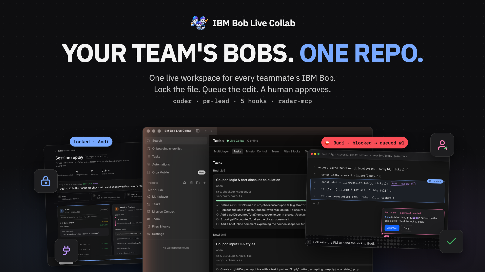
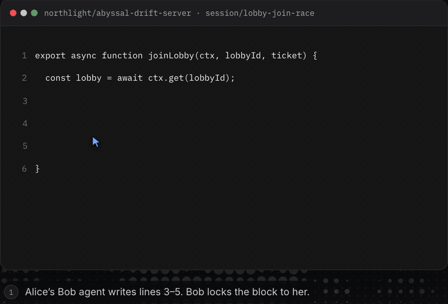
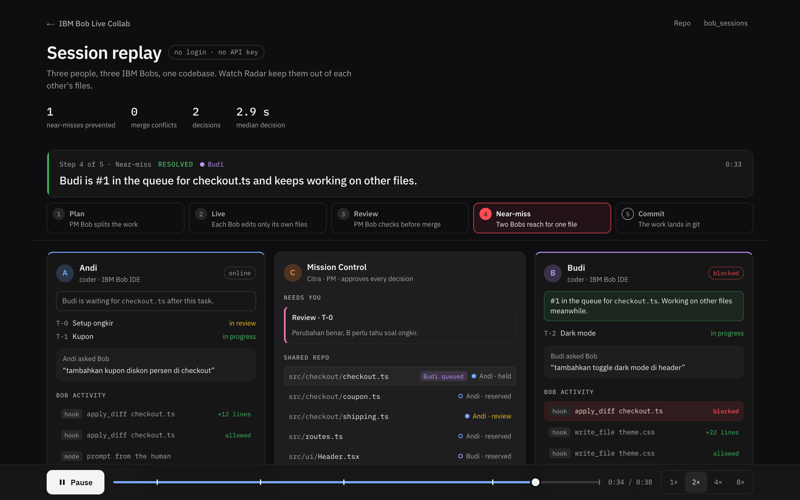
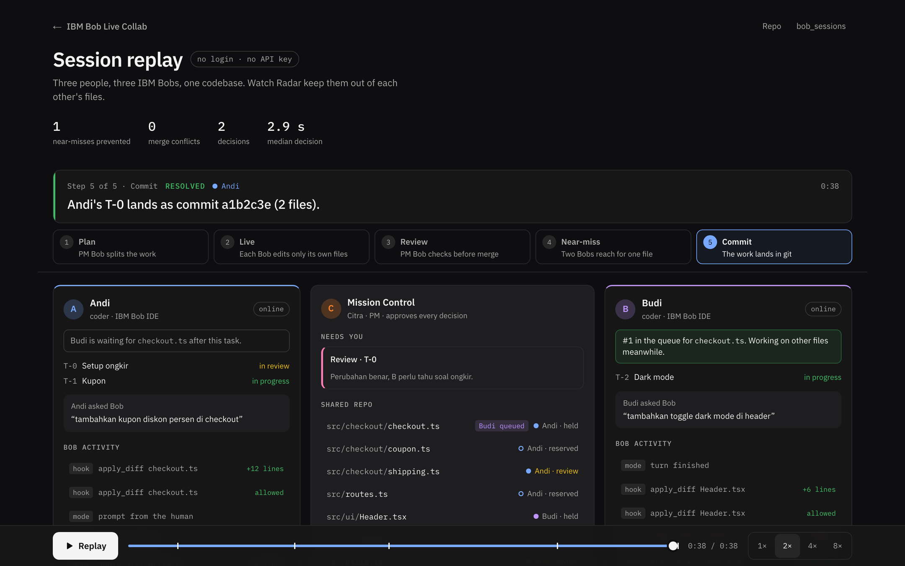
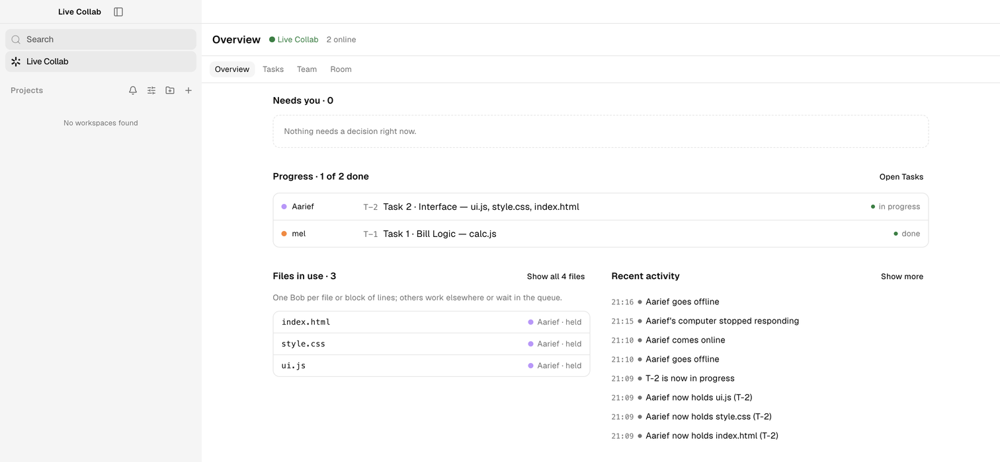
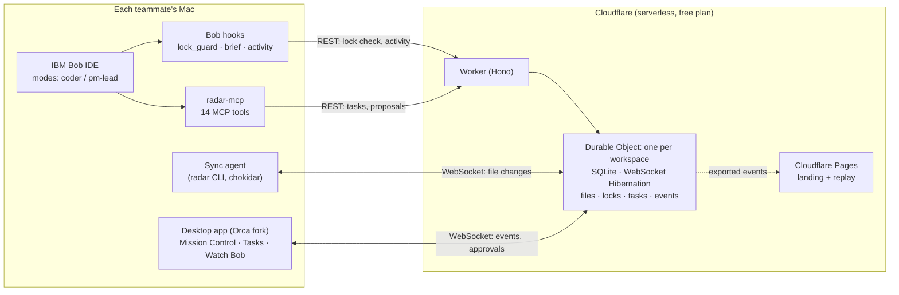
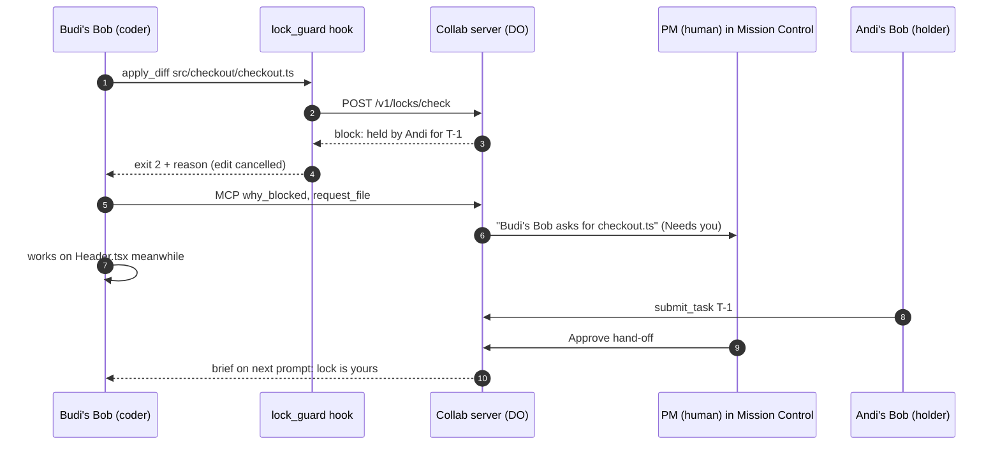

<div align="center">



<picture>
  <source media="(prefers-color-scheme: dark)" srcset=".github/readme/live-collab-lockup-white.png" />
  
</picture>

# Live Collab

**Your team's IBM Bobs, working together.**

One live workspace for every teammate's IBM Bob. Shared locks, a queue, and a PM who approves before anything risky lands.

[](https://lablab.ai) [](#built-on-ibm-bob-primitives) [](#architecture) [](#built-on-ibm-bob-primitives) [](#tech-stack) [](#quick-start)

[**Landing page**](https://ibm-bob-live-collab.pages.dev) · [**Watch the replay**](https://ibm-bob-live-collab.pages.dev/demo/) · [**Download**](https://github.com/umarmuhdhor/IBM/releases) · [**Bob evidence**](bob_sessions/INDEX.md) · [**How Bob built it**](BOB_DEVELOPMENT.md)

<br />



<sub>Two Bobs reach for the same lines. The second one is blocked, queued, and gets the lock after a human PM approves.</sub>

</div>

---

| Where | Link |
|---|---|
| **Live site** | https://ibm-bob-live-collab.pages.dev |
| **Session replay** (no login, no API key) | https://ibm-bob-live-collab.pages.dev/demo/ |
| **Desktop app** | macOS arm64 `.dmg` from [GitHub Releases](https://github.com/umarmuhdhor/IBM/releases) |
| **IBM Bob usage** | [`BOB_DEVELOPMENT.md`](BOB_DEVELOPMENT.md) and [`bob_sessions/`](bob_sessions/INDEX.md) |
| **Event** | IBM Bob 2.0 Hackathon (lablab.ai), 25–27 Sep 2026 |

> Community hackathon project. Not an official IBM product.

## Contents

- [The problem](#the-problem)
- [What Live Collab does](#what-live-collab-does)
- [See it work](#see-it-work)
- [Built on IBM Bob primitives](#built-on-ibm-bob-primitives)
- [Architecture](#architecture)
- [Quick start](#quick-start)
- [Step by step in IBM Bob](#step-by-step-in-ibm-bob)
- [Run from source](#run-from-source)
- [Repository map](#repository-map)
- [Tech stack](#tech-stack)
- [Security and privacy](#security-and-privacy)
- [How IBM Bob built this project](#how-ibm-bob-built-this-project)
- [Limits](#limits)
- [Team](#team)
- [Credits](#credits)

## The problem

IBM Bob is great for one developer. Put three developers, each with their own Bob, on the same repo, and things break:

- Two Bobs edit the same file at the same time. One silently overwrites the other, or you get a merge conflict later.
- Nobody can see what a teammate's Bob is doing right now.
- An agent can plan work, but nobody decides who owns which file before the edits start.

Git branches only find these problems after the fact. Live Collab stops them before the write happens.

## What Live Collab does

Every teammate keeps **their own Bob account, their own Bob IDE, and their own context**. Live Collab adds a shared layer between them, like Google Docs for a team of agents.

| Feature | How |
|---|---|
| **One block, one Bob** | A `PreToolUse` hook checks a shared lock table before every write. A Bob holds a block of lines, or the whole file when it rewrites the file. Anyone else is blocked and queued. |
| **A near-miss explains itself** | The blocked Bob calls `why_blocked` and tells its human, in one sentence, who holds the file and what to do next. Then it works on something else. |
| **PM Bob proposes, a human decides** | The `pm-lead` mode can only read and propose. Plans, file conflicts and reviews land in **Needs you**, where a person clicks Approve or Deny. |
| **Live file sync** | A sync agent streams every saved file to the shared room. Teammates see it on disk in under a second. |
| **Watch a teammate's Bob** | Hook traces stream Bob's activity (tool calls, files, blocks) to the desktop app. Prompt text is shared only if the member opts in. |
| **Tasks with steps** | The PM Bob splits the goal into tasks with 3–6 steps. Coders check steps off, and the PM board updates live. |
| **Review, then commit** | The PM Bob reviews a task's diff and the files that import it. A human approves, and the server makes one commit per task, co-authored by IBM Bob. |

Three words sum it up: **Visible** (every Bob shows its owner, file and last hook on one screen), **Locked** (a block has one holder, others queue), **Human-approved** (agents suggest, a person approves).

## See it work

The [replay](https://ibm-bob-live-collab.pages.dev/demo/) plays back a recorded session in the browser: three people, three Bobs, one `toko-demo` repo. From that session: **1** near-miss caught by a hook, **2** decisions shown to a human, **0** merge conflicts, **2.9 s** median time to a decision.

<table>
<tr>
<td width="50%"></td>
<td width="50%"></td>
</tr>
<tr>
<td><b>Near-miss.</b> Budi's Bob tries <code>apply_diff checkout.ts</code>. The hook blocks it, Budi is first in the queue, and his Bob moves on to <code>theme.css</code>.</td>
<td><b>Commit.</b> The PM Bob reviewed task T-0, a human approved it, and it lands in git as one commit.</td>
</tr>
</table>

<p align="center">

<br />
<sub>The desktop app (an Orca fork). Overview shows what needs you, each coder's task progress, which files are held, and recent activity, updated live.</sub>
</p>

## Built on IBM Bob primitives

**IBM Bob IDE is the core of the product.** All AI work happens in each teammate's Bob IDE. The server never calls an LLM. Joining a workspace installs a `.bob/` kit ([`radar/bob-kit`](radar/bob-kit)) that turns Bob into a team player. ("Radar" is the internal name of the collab layer: `radar` CLI, `radar-mcp`.)

### Custom modes

| Mode | Slug | Tools | Job |
|---|---|---|---|
| Live Collab Coder | `coder` | read, edit, execute, mcp | Works only on its own task's files. When a write is refused, it calls `why_blocked` and never retries or works around the lock through the shell. |
| Live Collab PM Lead | `pm-lead` | read, mcp | Plans, arbitrates file conflicts and reviews. It cannot write files, run commands, or approve its own proposals. |

### Hooks

| Event | Script | What it does |
|---|---|---|
| `SessionStart` | `brief.js start` | Puts a team brief of 6 lines or fewer into Bob's context: your task, your files, who holds what. |
| `UserPromptSubmit` | `brief.js prompt` | Adds only what changed since the last prompt (PM decisions, notifications, new locks). Adds nothing when nothing changed, to save Bobcoin. |
| `PreToolUse` | `lock_guard.js` | Asks the server if this member may write the file. If not, exits 2 and the server's reason reaches Bob as the tool error. Fails open after 1.6 s; the server is the real guard. |
| `PostToolUse` | `mark_ai_edit.js` | Streams activity and marks lines written by AI. |
| `Stop` | `stop.js` | Ends the turn in the "Watch Bob" timeline. |

### `radar-mcp` (14 tools, stdio)

| For | Tools |
|---|---|
| Coder | `my_tasks`, `complete_step`, `why_blocked`, `request_file`, `submit_task`, `team_activity` |
| PM Lead | `team_status`, `propose_plan`, `list_requests`, `propose_decision`, `get_task_diff`, `propose_review`, `notify`, `session_report` |

Every `propose_*` call creates a card in Mission Control. Only the human owner's token can approve it; the server answers `403` to the PM agent's token.

## Architecture



**Why a Durable Object:** one object per workspace takes every connection and handles messages one at a time. Two Bobs that reach for the same file in the same millisecond cannot both win, with no extra locking. No VPS, no database server, no LLM API key.

**Two layers of enforcement:** the hook stops Bob before it writes, and the server rejects any `file.update` from someone who does not hold the lock. The second layer also catches manual edits and `sed`; the sync agent restores the file.

### The near-miss, step by step



More detail: [`ARCHITECTURE.md`](ARCHITECTURE.md) (Bahasa Indonesia) and the API contract in [`plan/ref/R3-kontrak-api.md`](plan/ref/R3-kontrak-api.md).

## Quick start

You need macOS on Apple Silicon and IBM Bob IDE 2.1 or later.

1. **Download** the latest `.dmg` from [GitHub Releases](https://github.com/umarmuhdhor/IBM/releases) and drag the app to Applications.
2. **Allow the unsigned app.** System Settings → Privacy & Security → **Open Anyway**, or run:

   ```bash
   xattr -dr com.apple.quarantine "/Applications/Live Collab.app"
   ```

3. **Share or join.**
   - *Owner (the PM):* open your project folder, go to **Live Collab → Multiplayer**, click **Share &lt;folder&gt;**. You become the room's PM. A join code such as `K7QM-3XPA` is copied for you. One code per teammate, valid for 72 hours.
   - *Teammate (a coder):* **Live Collab → Multiplayer → Join a workspace**. Enter the code and your name. Everyone who joins with a code is a coder. Files sync to `~/live-collab/<workspace>` and the Bob kit is installed.
4. **Open in IBM Bob.** Click **Open in IBM Bob**, click **Trust** in Bob IDE, and switch the mode to **Live Collab PM Lead** (owner) or **Live Collab Coder** (teammates). The next section walks through every click.

Starter prompts for both roles are in [`radar/bob-kit/prompts/`](radar/bob-kit/prompts/). The full walkthrough in Bahasa Indonesia, with a check after every step, is in [`deploy.md`](deploy.md) §5.1.

<details>
<summary>Join without the app (terminal only)</summary>

```bash
curl -fsSL https://live-collab.afindo-mi01.workers.dev/j/<CODE> | sh
```

This installs Node and the `radar` CLI in `~/.radar`, redeems the code, syncs the folder, and opens IBM Bob IDE.

</details>

## Step by step in IBM Bob

After you share or join (Quick start step 3), this is what a working session looks like. Every teammate does steps 1–3 on their own Mac.

### 1. Open the project in IBM Bob IDE

1. In the Live Collab app, open **Live Collab** in the sidebar and click **Open in IBM Bob**.
   Bob IDE opens the shared folder (`~/live-collab/<workspace>`, or the owner's own folder).
2. Bob asks whether you trust the folder. Click **Trust**. In Restricted Mode the Bob panel stays empty and the Live Collab kit does not load.

### 2. Switch Bob to the Live Collab mode

1. In the Bob panel, open the **mode picker** (it shows the current mode, for example `Code`).
2. Pick the mode for your role:

   | Your role | Pick this mode | What it can do |
   |---|---|---|
   | PM (the owner who shared the folder) | **Live Collab PM Lead** | Read code, plan tasks, review, and settle file conflicts. It does not edit code. |
   | Coder (everyone who joined with a code) | **Live Collab Coder** | Edit only the files of its own task. Other people's files are blocked. |

3. Start a **new task** in the Bob panel. The first line of Bob's context is a `[Radar]` brief: who holds which file and the latest decisions.
4. The first `radar` tool call asks for permission once. Click **Approve**.

If the Live Collab modes are missing, close Bob IDE and click **Open in IBM Bob** again from the app. If they are still missing, reinstall the kit: `~/.radar/bin/radar kit install --dir ~/live-collab/<workspace>`.

### 3. Give Bob its first prompt

**PM: plan the session.** Replace `<goal>` and use member IDs from the **Team** tab.

```text
Session goal: <goal>. Team: A and B (coders). Start with team_status, read the relevant files, then build a plan with propose_plan. No file may appear in two tasks; shared files go in queued_files.
```

The plan waits in **Mission Control** until it is approved. Then each coder sees their task on the **My tasks** tab.

**Coder: start your task.** On the **My tasks** tab, click **Start in Bob** on your task card. The app marks the task active, copies a ready prompt, and opens Bob IDE. Check that the mode is **Live Collab Coder**, then paste the prompt. Or type it yourself:

```text
Start work: call radar my_tasks, then work only on your active task. Re-read a file before you edit it.
```

**Coder: an edit was blocked.** Another Bob holds those lines. Bob gets a `RADAR` message instead of overwriting their work.

```text
Continue your active task. If Radar rejected an edit, call why_blocked first, then work on another file.
```

**Coder: finished.**

```text
Check your work (typecheck/test if there are any). When it is done, call radar submit_task with a 1–3 sentence summary.
```

Then click **Mark task done** on your task card.

**PM: review a submitted task.**

```text
Task <id> was submitted. Review it with get_task_diff: check changed exports and whether the files importing them belong to another task, then propose the review with propose_review.
```

**PM: two coders want the same file.**

```text
There is a new file request. Read list_requests, compare both tasks and the contested file, then propose a decision with propose_decision (one-sentence reason).
```

**PM: end of session.** `Write the session report with session_report.`

### 4. Watch and decide in the app

| What you want | Where | What you see |
|---|---|---|
| Who is online | **Team** tab | Every member with their status |
| What a teammate's Bob is doing | **Team** → **Watch** (opens **Watch Bob**) | Live Bob activity and feed. Prompt text shows only if that member turned on **Share my prompts** in **Settings**. |
| Who holds which file | **Files & locks** tab | Locked files with the holder's name |
| Plans, reviews, file conflicts | **Mission Control** tab | Proposal cards with **Approve** / **Deny**, or **Approve & commit** / **Send back** for reviews |

One Bob holds a block of lines, or the whole file if it rewrites the whole file. A second coder can still edit other parts of the same file.

## Run from source

Toolchain: Node 24 and pnpm 12 (`nvm use 24 && corepack enable`). There is no root `package.json`; run each workspace with `pnpm -C`.

```bash
pnpm -C radar install
```

```bash
pnpm -C app install
```

| Command | What it runs |
|---|---|
| `pnpm -C radar dev:server` | Collab server locally (`wrangler dev`: Worker + Durable Object + SQLite) |
| `pnpm -C radar dev:mock` | Mock server, enough for UI work and tests |
| `pnpm -C app dev` | Desktop app in dev mode (uses the production server unless `LIVE_COLLAB_SERVER` is set) |
| `LIVE_COLLAB_SERVER=http://localhost:8787 pnpm -C app dev` | Desktop app against your local server |
| `pnpm -C radar test` | Tests for server, sync, hooks and MCP |
| `pnpm -C app build:mac` | Build the `.dmg` into `app/dist/` |
| `pnpm -C radar deploy:web` | Deploy landing + replay to Cloudflare Pages |

Deploying your own server, admin CLI and troubleshooting: [`deploy.md`](deploy.md).

## Repository map

| Path | What is inside |
|---|---|
| [`radar/packages/server`](radar/packages/server) | Collab server: Cloudflare Worker + Durable Object, lock engine, tasks, commits |
| [`radar/packages/sync`](radar/packages/sync) | Sync agent and `radar` CLI |
| [`radar/packages/common`](radar/packages/common) | Shared types, zod schemas and the event reducer |
| [`radar/packages/hooks`](radar/packages/hooks) | Bob hooks (`lock_guard`, `brief`, activity), bundled with esbuild |
| [`radar/packages/mcp`](radar/packages/mcp) | `radar-mcp`, the MCP server Bob calls |
| [`radar/bob-kit`](radar/bob-kit) | The `.bob/` kit: custom modes, rules, hook config, prompts |
| [`radar/packages/ui`](radar/packages/ui) | Shared React components for the app and web |
| [`radar/packages/web`](radar/packages/web) | Landing page and session replay (Next.js static export) |
| [`app/`](app) | Desktop app, a fork of [Orca](https://github.com/stablyai/orca) (Electron) |
| [`bob_sessions/`](bob_sessions/INDEX.md) | IBM Bob task-summary screenshots, one per session |
| [`plan/`](plan/README.md) | Phase plans, contracts (`plan/ref/R1–R7`), progress and decision logs |

## Tech stack

| Layer | Stack |
|---|---|
| Server | Cloudflare Workers, Durable Objects (SQLite, WebSocket Hibernation), Hono, zod, GitHub Git Data API |
| Sync agent | Node, chokidar, ws |
| Bob integration | Bob IDE custom modes (YAML), hooks (Node, esbuild), MCP TypeScript SDK |
| Desktop app | Electron, React 19, zustand, xterm, Monaco, Tailwind (based on Orca) |
| Web | Next.js 15 static export on Cloudflare Pages |

Hosting runs on free plans: Cloudflare Workers, Durable Objects and Pages, plus GitHub.

## Security and privacy

- Member tokens are stored on the server as hashes. The PM approval token is separate, and only it can approve proposals.
- The PM agent has no tool to approve its own proposals.
- The app keeps tokens in Electron `safeStorage` (macOS Keychain), never in logs.
- Bob activity never contains file contents. Prompt text is shared only when a member turns on **Share my prompts**.
- Hooks run with the user's permissions. We say so in [`SECURITY.MD`](SECURITY.MD).
- The repo is public and started from the [IBM Hackathon template](https://github.com/watsonxhackathon/ibm-hackathon-template): its `.gitignore`, `.bobignore` (keeps credentials out of Bob's context), `.env.example` and [`SECURITY.MD`](SECURITY.MD) are kept as-is, and gitleaks runs in CI. All demo data is synthetic ([`DATA_SOURCES.md`](DATA_SOURCES.md)).

<details>
<summary>Before every commit (from the IBM template)</summary>

- [ ] Reviewed `git diff` for sensitive data
- [ ] No hardcoded API keys or passwords
- [ ] `.env` is not in staged changes (`git check-ignore -v .env` confirms it is ignored)
- [ ] No file names containing `credential`, `secret`, `token`, `password` or `apikey`, and no `config.json`
- [ ] All credentials come from environment variables

</details>

## How IBM Bob built this project

Bob is both the runtime of Live Collab and the tool we built it with.

- Each of the four members built slices of the product in Bob IDE. Every Bob session has a task-summary screenshot in [`bob_sessions/`](bob_sessions/INDEX.md) (32 so far).
- Code written by Bob was committed unchanged with a `Bob-Assisted: bob_sessions/<png>` trailer. Human fixes went into separate commits, so Bob's part of the diff stays visible.
- We also used Bob to test Bob: behaviour sessions against the real server checked that the PM agent never gives one file to two tasks, and that a blocked coder calls `why_blocked` instead of working around the lock.

Full breakdown by member, slice and Bobcoin: [`BOB_DEVELOPMENT.md`](BOB_DEVELOPMENT.md).

## Limits

- macOS arm64 only. The build is ad-hoc signed, not notarized.
- One workspace per server at a time, up to 8 members.
- Shared folders follow `.gitignore`. Binary files and files over 1 MB stay local. Maximum 3000 files.
- Bob IDE disables the Bob panel in untrusted workspaces, so each member must click **Trust** once.

## Team

| Person | Lane | Built |
|---|---|---|
| Alief | Core | Collab server (Worker + Durable Object), lock engine, sync agent |
| Umar | Bob | Custom modes, hooks, `radar-mcp`, Bob evidence |
| Aarief | App | Desktop app (Orca fork), shared UI components |
| Imelda | Web and media | Landing page, session replay, video, deck |

## Credits

The desktop app is built on [Orca](https://github.com/stablyai/orca) (MIT) by Stably AI, vendored in [`app/`](app). Orca's own README is [`app/README.md`](app/README.md) and its license is [`app/LICENSE`](app/LICENSE).

IBM and IBM Bob are trademarks of IBM. This is a community hackathon project and is not affiliated with or endorsed by IBM.
