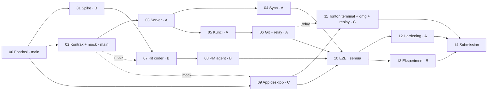

# Plan detail per fase — IBM Bob Live Collab (v0.3)

> Rencana kerja teknis dari nol sampai submit di IBM Bob 2.0 Hackathon (Jum 25 Sep 23:00 → Min 27 Sep 23:00 WITA).
> Ringkasan tim (lane, branch, jadwal, ECC, bukti Bob) ada di [`../PLAN.md`](../PLAN.md). Produk: [`../PRD.md`](../PRD.md). Desain: [`../DESIGN.md`](../DESIGN.md).
> Codename teknis `radar` tetap dipakai di kode (CLI `radar`, paket `@radar/*`, `radar-mcp`, folder `radar/`). Nama produk: **IBM Bob Live Collab**.

---

## 1. Cara pakai

1. Buka [`PROMPT.md`](PROMPT.md) dan salin blok prompt.
2. Ubah dua baris: `LANE: A|B|C` dan `FASE: NN`.
3. Tempel ke Claude Code (dengan plugin ECC) di root repo. Pilih model sesuai §3.
4. Kalau agent berhenti di **BOB SLICE**, kerjakan prompt itu di Bob IDE, jalankan `bob-evidence.sh`, lalu balas "bob selesai".

Agent mengisi `PROGRESS.md` dan `log/fase-XX.md`, commit, push branch lane, lalu berhenti dan menyebut fase berikutnya. Kalau terputus, jalankan prompt yang sama: agent melanjutkan dari checklist.

---

## 2. Struktur folder

```text
plan/                         (dipindah ke plan/ di fase 00)
├── README.md                 ← file ini
├── PROMPT.md                 ← satu prompt (ubah LANE + FASE)
├── PROGRESS.md               ← status fase + requirement P0
├── ref/                      ← kontrak bersama
│   ├── R1-struktur-repo.md   ← layout fork Orca + workspace radar/
│   ├── R2-skema-db.md        ← SQL SQLite + invariant
│   ├── R3-kontrak-api.md     ← REST, WebSocket (termasuk term.* §3.9), event, MCP
│   ├── R4-mesin-kunci.md     ← state machine kunci & task
│   ├── R5-konvensi.md        ← gaya kode, test, env, warna, larangan nama file (§8)
│   ├── R6-model-ai.md        ← model + agent/skill ECC per fase
│   └── R7-bukti-bob.md       ← protokol bukti IBM Bob (screenshot + ekspor + trailer)
├── fase-00 … fase-14
└── log/
    ├── DECISIONS.md          ← keputusan (ID ber-prefix lane: D-A.., D-B.., D-C..)
    └── fase-XX.md            ← laporan per fase
```

---

## 3. Peta fase

| No | Fase | Lane | Branch | Output utama | Requirement PRD | Slot WITA | Model |
|---|---|---|---|---|---|---|---|
| 00 | Fondasi: fork Orca + `radar/` | A | `main` | fork, workspace `radar/`, template IBM, toko-demo, CI, ECC | §12, NFR-04/07/10/11 | Jum 23:00–Sab 00:30 | Sonnet 5 |
| 01 | Spike & GATE 1 | B | `lane/bob` | `spike/`, `docs/SPIKE_RESULTS.md` | §17 spike 1–8 | Sab 00:30–04:00 | Sonnet 5 |
| 02 | Common + mock server | A | `main` | tipe, zod, reducer, mock (termasuk `term.*`) = **kontrak beku** | BC-04, UI-04/05, JT | Sab 00:30–02:30 | Sonnet 5 |
| 03 | Server inti | A | `lane/core` | Fastify + SQLite + auth + WS + deploy | SV-01, SV-08 | Sab 02:30–07:00 | Opus 5.5 |
| 04 | Sync agent | A | `lane/core` | CLI `radar`, watcher, anti-gema | SY-01..05 | Sab 07:00–09:00 | Opus 5.5 |
| 05 | Kunci, task, permintaan, proposal | A | `lane/core` | `/v1/locks/check`, alokasi, antrean | SV-02..06, MA-07 | Sab 14:00–18:00 | Opus 5.5 |
| 06 | Git + diff + **relay terminal** | A | `lane/core` | commit per task, `get_task_diff`, relay `term.*` | SV-07, MA-04, JT-03 | Sab 18:00–21:00 | Opus 5.5 |
| 07 | Kit `.bob/` coder | B | `lane/bob` | mode `coder`, hook, `radar-mcp` coder | BC-01..04, BC-07 | Sab 09:00–16:00 | Sonnet 5 · high |
| 08 | Main agent `pm-lead` | B | `lane/bob` | mode `pm-lead`, tool PM | MA-01..05 | Sab 16:00–21:00 | Sonnet 5 · high |
| 09 | App desktop (fork Orca) | C | `lane/app` | agent `bob`, panel Live Collab, `@radar/ui` | DA-01..04, UI-01..04, UI-07 | Sab 00:30–16:00 | Sonnet 5 · high |
| 10 | Integrasi E2E | Semua | `main` | `sim-3pc`, uji 3 Mac, **milestone Sab 23:00** | semua P0 | Sab 21:00–Min 02:00 | Opus 5.5 |
| 11 | Tonton terminal, `.dmg`, replay web | C | `lane/app` | JT-01/02, `.dmg`, `/demo` | JT-01..05, DA-01, UI-05 | Sab 16:00–Min 06:00 | Sonnet 5 · high |
| 12 | Hardening & P1 | A | `lane/core` | kedaluwarsa, reconnect, invite | SV-09/10, SY-06/07, IN-02 | Min 04:00–11:00 | Sonnet 5 |
| 13 | Eksperimen A/B | B | `lane/bob` | `docs/EXPERIMENT.md` | §04, §17 | Min 04:00–11:00 | Sonnet 5 |
| 14 | Submission | Semua | `main` | statement, video ≤ 3 menit, deck, bukti Bob | §15, EV-01..03, NFR-11 | Min 11:00–23:00 | Sonnet 5 |

**GATE 1** Sab 04:00 · **Kontrak beku** Sab 02:30 (fase 02 merge) · **Sinkron 1** Sab 16:00 · **Milestone** Sab 23:00 · **GATE 2 / freeze** Min 11:00.

---

## 4. Grafik dependensi



Garis putus-putus berarti fase itu boleh dikerjakan paralel melawan **mock server** fase 02, lalu disambungkan ke server asli di fase 10.

---

## 5. Aturan emas

1. **Kontrak dulu.** `ref/R2`, `R3`, `R4` adalah kontrak antar-paket. Hanya Lane A yang mengubahnya, lewat contract PR + entri DECISIONS.
2. **Satu fase per sesi.** Agent tidak mengerjakan fase lain walaupun "sekalian".
3. **Folder = lane.** Jangan menyentuh folder lane lain (tabel di `../PLAN.md` §2).
4. **P0 sebelum P1.**
5. **Test adalah bukti.** ECC `tdd-workflow` + `verification-loop`.
6. **Bob slice itu nyata.** Setiap fase yang punya Bob slice menghasilkan kode yang benar-benar dibuat Bob + bukti di `bob_sessions/` (R7).
7. **Tanpa secret, tanpa nama file terlarang** (R5 §8).
8. **Demo adalah produk.** Keputusan diuji terhadap naskah video PRD §15 (≤ 3 menit).
9. **Bobcoin hemat.** 40 per akun (anggaran di `../PLAN.md` §7).

---

## 6. Definisi selesai proyek

Lihat [`../PLAN.md`](../PLAN.md) §9.
