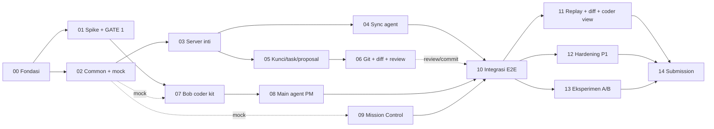

# Plan Eksekusi — Bob Radar (PRD v0.2)

> Rencana kerja lengkap untuk membangun Bob Radar dari nol sampai submit di IBM Bob 2.0 Hackathon
> (Jum 25 Sep 2026 23:00 WITA → Min 27 Sep 2026 23:00 WITA, 48 jam).
> Sumber kebenaran produk: [`../Bob Radar PRD v0.2.md`](../Bob%20Radar%20PRD%20v0.2.md).
> Folder ini adalah sumber kebenaran **cara membangunnya**.

---

## 1. Cara pakai (3 langkah)

1. Buka [`PROMPT.md`](PROMPT.md), salin seluruh blok prompt.
2. Ubah **satu baris** paling atas: `FASE: 00` → nomor fase yang mau dijalankan (`00`, `01`, … `14`).
3. Tempel ke agent (Claude Code atau IBM Bob) di root repo ini. Pilih model sesuai kolom **Model** di tabel §3.

Agent akan membaca fase itu, mengerjakan semua langkahnya, menjalankan verifikasi, mengisi
[`PROGRESS.md`](PROGRESS.md) dan `log/fase-XX.md`, lalu berhenti dan memberi tahu nomor fase berikutnya.
Kalau fase terputus di tengah, jalankan prompt yang sama dengan nomor yang sama: agent melanjutkan dari checklist yang belum dicentang.

---

## 2. Struktur folder

```text
plan/
├── README.md                 ← file ini: peta, urutan, jadwal, model
├── PROMPT.md                 ← SATU prompt untuk semua fase (ubah 1 baris)
├── PROGRESS.md               ← status setiap fase (diisi agent)
├── ref/                      ← kontrak bersama, WAJIB diikuti semua fase
│   ├── R1-struktur-repo.md   ← layout monorepo, paket, script, CLI
│   ├── R2-skema-db.md        ← SQL lengkap SQLite + invariant
│   ├── R3-kontrak-api.md     ← REST, WebSocket, event catalog, error code
│   ├── R4-mesin-kunci.md     ← state machine kunci & task, algoritma, tabel keputusan
│   ├── R5-konvensi.md        ← gaya kode, test, env var, Definition of Done
│   └── R6-model-ai.md        ← rekomendasi model per fase + alasan + eskalasi
├── fase-00-fondasi.md
├── fase-01-spike-gate1.md
├── fase-02-common-mock.md
├── fase-03-server-inti.md
├── fase-04-sync-agent.md
├── fase-05-kunci-task-proposal.md
├── fase-06-git-diff-review.md
├── fase-07-bob-coder-kit.md
├── fase-08-main-agent-pm.md
├── fase-09-mission-control.md
├── fase-10-integrasi-e2e.md
├── fase-11-replay-diff-coder.md
├── fase-12-hardening-p1.md
├── fase-13-eksperimen-ab.md
├── fase-14-submission.md
└── log/
    ├── DECISIONS.md          ← keputusan & deviasi dari kontrak (append-only)
    └── fase-XX.md            ← laporan per fase (dibuat agent)
```

---

## 3. Peta fase

| No | Fase | Output utama | Requirement PRD | Jalur | Slot WITA | Estimasi | Model (Claude Code) | Prasyarat |
|---|---|---|---|---|---|---|---|---|
| 00 | Fondasi repo | Monorepo pnpm, CI, repo contoh `toko-demo`, checklist kickoff | §12, §16, NFR-04, NFR-07 | Semua | Jum 23:00–Sab 01:00 | 1,5–2 j | **Sonnet 5** (hemat: Haiku 4.5) | – |
| 01 | Spike & GATE 1 | `spike/`, `docs/SPIKE_RESULTS.md`, keputusan gate | §17 spike 1–6, §18 OQ 1–5 | Orang 2 (+Orang 1 spike 4) | Sab 01:00–04:00 | 3 j | **Sonnet 5** | 00 |
| 02 | `@radar/common` + mock server | Tipe, zod schema, normalisasi payload hook, reducer event, mock server | BC-04 (normalisasi), UI-04/05 (reducer) | Orang 1 | Sab 01:00–02:30 | 1,5 j | **Sonnet 5** | 00 |
| 03 | Server inti | Fastify + SQLite + auth + event log + file store + WebSocket + deploy | SV-01, SV-08, NFR-02/04 | Orang 1 | Sab 02:30–07:00 | 4 j | **Opus 5.5** | 02 |
| 04 | Sync agent | CLI `radar join`, watcher, anti-gema, penolakan, heartbeat | SY-01..05 (+ dasar SY-07) | Orang 1 | Sab 07:00–10:00 | 3 j | **Opus 5.5** (alt: Sonnet 5) | 03 |
| 05 | Mesin kunci, task, permintaan, proposal | `/v1/locks/check`, alokasi, antrean, request, proposal, brief, decision | SV-02..06, MA-07, §06 | Orang 1 | Sab 16:00–21:00 | 5 j | **Opus 5.5** | 03 |
| 06 | Git worker, diff & review | Commit per task + push, `get_task_diff` + analisis importer | SV-07, MA-04 | Orang 1 | Sab 21:00–Min 01:00 | 3 j | **Opus 5.5** (alt: Sonnet 5) | 05 |
| 07 | Paket `.bob/` coder | Mode `coder`, 4 hook, `radar-mcp` tool coder, bundle kit | BC-01..04, BC-07 | Orang 2 | Sab 10:00–16:00 | 5 j | **Sonnet 5** | 01, 02 (mock) |
| 08 | Main agent `pm-lead` | Mode `pm-lead`, tool MCP PM, prompt PM | MA-01..05, MA-07 | Orang 2 | Sab 16:00–21:00 | 4 j | **Sonnet 5** | 07 |
| 09 | Mission Control | Next.js: task board, pohon file berkunci, antrean keputusan, feed | UI-01..04 | Orang 3 | Sab 08:00–21:00 | 8 j | **Sonnet 5** | 02 (mock) |
| 10 | Integrasi E2E | `scripts/sim-3pc.ts`, uji 3 PC nyata, **milestone Sab 23:00** | Semua P0 | Semua (dipimpin Orang 2; Orang 1 bergabung setelah 06) | Sab 21:00–Min 02:00 | 3–4 j | **Opus 5.5** | 04, 05, 07, 08, 09 (06 untuk bagian review/commit) |
| 11 | Replay, diff viewer, tampilan coder | `/demo` replay statis, UI-06, UI-07 | UI-05 (P0), UI-06/07 (P1) | Orang 3 | Min 01:00–05:00 | 4 j | **Sonnet 5** | 09, 10 |
| 12 | Hardening & P1 | Kunci kedaluwarsa, reconnect, hapus/ganti nama, PostToolUse, laporan sesi, pemicu otomatis | SV-09/10, SY-06/07, BC-05, MA-06 | Orang 1 | Min 05:00–11:00 | 5 j | **Sonnet 5** (reconnect: Opus 5.5) | 10 |
| 13 | Eksperimen A/B & metrik | Protokol, script metrik, `docs/EXPERIMENT.md` | §04 metrik, §17 eksperimen | Orang 2 | Min 05:00–11:00 | 4 j | **Sonnet 5** (tabulasi: Haiku 4.5) | 10 |
| 14 | Submission | `bob_sessions/`, `BOB_DEVELOPMENT.md`, README juri, gitleaks, deck, video, cover | NFR-04, NFR-09, §15 | Semua | Min 11:00–23:00 | 8 j | **Sonnet 5** (cek mekanis: Haiku 4.5) | 13, 11 |

**GATE 1** Sab 04:00 (akhir fase 01) · **Milestone** Sab 23:00 (akhir fase 10: rencana → live → blokir → keputusan jalan di 3 PC) · **GATE 2 / feature freeze** Min 11:00 (akhir fase 12 & 13).

---

## 4. Grafik dependensi



Garis putus-putus = boleh dikerjakan paralel memakai **mock server** dari fase 02, lalu disambungkan ke server asli di fase 10.

---

## 5. Dua cara menjalankan

### A. Tim 3 orang (sesuai PRD §17) — paralel

| Orang | Urutan fase | Catatan |
|---|---|---|
| Orang 1 — server + sync | 00 → 02 → 03 → 04 → (tidur 10:00–16:00) → 05 → 06 → 10 → 12 | Pegang kontrak `ref/R2–R4`. Satu-satunya yang boleh mengubah kontrak (catat di `log/DECISIONS.md`). |
| Orang 2 — integrasi Bob | 00 → 01 → (tidur 04:00–10:00) → 07 → 08 → 10 → 13 | Semua kerja Bob dilakukan **di dalam IBM Bob** supaya `bob_sessions/` lengkap. |
| Orang 3 — Mission Control + pitch | 00 → (setup Next.js di 09, tidur 02:00–08:00) → 09 → 10 → 11 → 14 | Kembangkan UI melawan mock server sampai server asli siap. |

Setiap orang memakai prompt yang sama dari `PROMPT.md`, hanya baris `FASE:` yang berbeda. `PROGRESS.md` diisi per baris fase, jadi konflik merge kecil.

Kalau tim 4 orang: orang keempat mengambil fase 14 (pitch, deck, video) sejak Sab 23:00, Orang 3 fokus fase 09 + 11.

### B. Solo / berurutan

Jalankan 00 → 14 berurutan. Mock server (fase 02) tetap berguna untuk test cepat, tapi tidak wajib. Waktu realistis solo: ±60–70 jam kerja, jadi di hackathon 48 jam **wajib** memotong P1 sesuai urutan di PRD §16 (lihat fase 12 bagian "Urutan potong").

---

## 6. Rekomendasi model (ringkas)

Detail alasan, setelan effort, dan aturan eskalasi ada di [`ref/R6-model-ai.md`](ref/R6-model-ai.md).

| Tier | Model | ID | Dipakai untuk | Setelan |
|---|---|---|---|---|
| Berat | **Claude Opus 5.5** | `claude-opus-5-5` | Logika konkurensi & kebenaran: server inti (03), sync agent (04), mesin kunci (05), git worker (06), integrasi E2E & debugging (10), reconnect (12) | effort `high`; `xhigh` untuk debugging race di fase 10 |
| Utama | **Claude Sonnet 5** | `claude-sonnet-5` | Mayoritas implementasi: fondasi, spike, common, kit Bob, main agent, UI, replay, P1, eksperimen, dokumen submission | effort `medium`; `high` untuk fase 07/08 |
| Hemat | **Claude Haiku 4.5** | `claude-haiku-4-5-20251001` | Tugas mekanis: scaffolding ulang, tabulasi data eksperimen, checklist submission, rename massal, format dokumen | effort `low`–`medium` |

**Aturan praktis:** kalau fase yang dijalankan dengan Sonnet gagal verifikasi 2× berturut-turut pada masalah yang sama, jalankan ulang fase itu (baris `FASE:` sama) dengan Opus 5.5.

### Catatan kepatuhan hackathon (penting)

PRD menargetkan **100% sesi Bob diekspor ke `bob_sessions/`** dan menyebut `radar-mcp` "dibangun bersama Bob". Aturan hackathon IBM Bob biasanya menilai penggunaan Bob sebagai alat bangun. Karena itu:

- `PROMPT.md` netral-alat: bisa ditempel ke **IBM Bob** atau **Claude Code**.
- **Disarankan:** fase 01, 07, 08 (integrasi Bob) dan sebagian besar fase lain dijalankan **di IBM Bob**, lalu sesinya diekspor ke `bob_sessions/<nama>/fase-XX/`. Claude Code dipakai untuk review, debugging sulit, atau saat Bobcoin menipis.
- Di IBM Bob pemilihan model diatur Bob; gunakan kolom "Mode Bob" di `ref/R6-model-ai.md` sebagai padanannya.
- Konfirmasi aturan resmi saat kickoff (PRD §18 open question 6 & 7) di fase 00, lalu catat di `log/DECISIONS.md`.

---

## 7. Aturan emas (berlaku di semua fase)

1. **Kontrak dulu.** `ref/R2`, `R3`, `R4` adalah kontrak antar-paket. Kode mengikuti kontrak, bukan sebaliknya. Perubahan kontrak wajib dicatat di `log/DECISIONS.md` (tanggal, alasan, dampak) dan file `ref/` ikut diperbarui.
2. **Satu fase per sesi.** Agent tidak boleh mengerjakan fase lain walaupun "sekalian".
3. **P0 sebelum P1.** Tidak ada pekerjaan P1 sebelum semua P0 di fase itu hijau.
4. **Test adalah bukti.** Setiap kriteria penerimaan PRD dipetakan ke test atau langkah verifikasi manual yang tertulis.
5. **Tanpa secret di repo.** Token hanya di `.env` / `.radar/local.json` (keduanya di-ignore). Gitleaks dijalankan di CI.
6. **Demo adalah produk.** Setiap keputusan teknis diuji terhadap naskah demo PRD §15. Kalau tidak terlihat di demo dan bukan P0, tunda.
7. **Bobcoin hemat.** Brief ≤ 6 baris, main agent dipanggil hanya saat perlu, `--max-cost` untuk pemicu otomatis.

---

## 8. Definisi "selesai" untuk seluruh proyek (R0 · submit hackathon)

- [ ] Semua requirement **P0** di PRD §10 punya test hijau atau bukti manual di `log/`.
- [ ] Alur penuh (rencana → live → blokir → keputusan → review → commit GitHub) jalan di 3 PC nyata.
- [ ] Replay `/demo` jalan tanpa login, tanpa API key, walaupun server mati.
- [ ] Metrik §04 terukur dan dilaporkan jujur di `docs/EXPERIMENT.md`.
- [ ] `bob_sessions/`, `BOB_DEVELOPMENT.md`, README juri, video ≤ 4 menit, deck PDF, cover 16:9 siap.
- [ ] Gitleaks bersih di seluruh history, repo publik, dicek dari jendela incognito.
