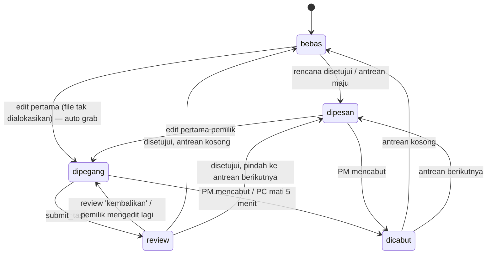

# R4 — Mesin kunci, siklus task, dan penerapan keputusan

> Terjemahan PRD §06, §07.3–7.5, §08, §09 menjadi algoritma yang bisa diuji. Implementasi: `packages/server/src/services/locks.ts`, `tasks.ts`, `proposals.ts`, `brief.ts`. **Setiap fungsi publik di sini berjalan di dalam satu `db.transaction`.**

## 1. Status kunci per file

| Status (UI) | Representasi DB | Arti |
|---|---|---|
| **bebas** | tidak ada baris `lock` | Siapa pun (coder) boleh menulis; penulis pertama mengambil kunci |
| **dipesan** | `lock.state='dipesan'` | Dialokasikan ke task lewat rencana/antrean, belum ditulis |
| **dipegang** | `lock.state='dipegang'` | Task pemilik sudah menulis |
| **review** | `lock.state='review'` | Task sedang di-review; kunci tetap milik task |
| **dicabut** | event `lock.revoked`, baris dihapus | Transien, langsung menjadi bebas / pindah ke antrean |



## 2. Status task

| Dari | Ke | Pemicu | Efek samping |
|---|---|---|---|
| – | `draf` | proposal plan dibuat | Tidak disimpan sebagai task sampai disetujui (task draf hanya hidup di payload proposal; board menampilkannya dari proposal `menunggu`) |
| `draf` | `terbuka` | PM menyetujui proposal plan | `task.created`, alokasi + kunci `dipesan` |
| `draf` | `batal` | PM menolak proposal plan | proposal `ditolak` |
| `terbuka` | `dikerjakan` | edit pertama pada file task (check atau update) | `task.status`, `member.active_task_id = task` |
| `dikerjakan` | `review` | `submit_task` | lock task → `review` |
| `review` | `dikerjakan` | review `kembalikan` disetujui, ATAU pemilik mengedit file task saat review | proposal review `menunggu` untuk task ini → `kedaluwarsa` |
| `review` | `selesai` | review `setujui*` disetujui | commit, lepas/pindah kunci |
| `terbuka`/`dikerjakan` | `batal` | `POST /v1/tasks/:id/cancel` (mc) | lepas/pindah kunci & alokasi |

Task **adhoc**: dibuat otomatis `dikerjakan`, judul `Ad-hoc <nama>`, `adhoc=1`, kalau coder menulis file bebas tanpa task aktif. Diperlakukan seperti task biasa (bisa di-submit, di-review, di-commit).

## 3. `checkWrite(member, path, via)` — inti SV-02 & SV-03

Dipanggil oleh `POST /v1/locks/check` (via=`hook`, sekali per path) dan oleh WebSocket `file.update`/`file.delete` (via=`sync`).

```text
function checkWrite(member, path, via):
  if isIgnored(path):                         return ALLOW('ignored_path')
  if member.role == 'pm':                     return BLOCK('pm_readonly')          # tanpa request
  lock = lockRepo.get(path)

  if lock == null:
    # file bebas — tetapi mungkin ada antrean yang tertinggal (tidak boleh terjadi, I4; defensif)
    head = allocationRepo.headOf(path)
    if head != null and head.task.owner != member:
      promote(path, head)                     # jadikan dipesan untuk head, lalu lanjut sebagai 'reserved_by_other'
      return blockFor(member, path, via)
    task = resolveActiveTask(member)          # §4
    allocationRepo.upsert(task, path, pos=0, source='auto')
    lockRepo.insert(path, task, member, 'dipegang')
    markTaskWorking(task)                     # terbuka → dikerjakan
    emit lock.acquired {auto:true}
    return ALLOW('grabbed')

  if lock.member_id == member.id:
    if lock.state == 'dipesan':
      lock.state = 'dipegang'; emit lock.acquired {auto:false}
    if lock.state == 'review':
      lock.state = 'dipegang'                 # semua lock task ini ikut kembali ke 'dipegang'
      taskToWorking(lock.task, cause='edited_in_review'); expirePendingReviewProposals(lock.task)
    markTaskWorking(lock.task); member.active_task_id = lock.task_id
    return ALLOW('own')

  return blockFor(member, path, via)

function blockFor(member, path, via):
  lock = lockRepo.get(path)
  reqTask = resolveActiveTask(member)
  request = requestRepo.findOpen(reqTask, path) ?? requestRepo.create(reqTask, path, lock, source=via)
            # create → emit request.created (hanya sekali per task+file: SV-05 / I10)
  blockRepo.insert(member, reqTask, path, lock, via, request.id)
  emit lock.blocked
  reason = lock.state == 'dipesan' ? 'reserved_by_other'
         : lock.state == 'review'  ? 'in_review_by_other'
         : 'held_by_other'
  return BLOCK(reason, holder=lock, requestId=request.id)
```

### Tabel keputusan (dijadikan test tabel di fase 05)

| # | Kondisi | via | Hasil | reason | Efek |
|---|---|---|---|---|---|
| 1 | path diabaikan | hook/sync | allow | `ignored_path` | – |
| 2 | member PM | hook/sync | block | `pm_readonly` | tidak ada request |
| 3 | bebas, tanpa antrean | hook/sync | allow | `grabbed` | lock `dipegang` untuk task aktif (adhoc kalau perlu) |
| 4 | `dipesan` oleh task saya | hook/sync | allow | `own` | → `dipegang`, task → `dikerjakan` |
| 5 | `dipegang` oleh task saya | hook/sync | allow | `own` | – |
| 6 | `dipegang` oleh task saya yang lain | hook/sync | allow | `own` | active_task pindah ke task itu |
| 7 | `review` oleh task saya | hook/sync | allow | `own` | task kembali `dikerjakan`, proposal review kedaluwarsa |
| 8 | `dipesan` oleh orang lain | hook/sync | block | `reserved_by_other` | request (dedup) + block |
| 9 | `dipegang` oleh orang lain | hook/sync | block | `held_by_other` | request (dedup) + block |
| 10 | `review` oleh orang lain | hook/sync | block | `in_review_by_other` | request (dedup) + block |
| 11 | #9 diulang 5× | hook | block | `held_by_other` | tetap 1 request aktif, 5 baris block |

### Penerimaan `file.update` (lapis kedua, SY-04 / §6 "Dua lapis penegakan")

```text
on file.update {path, baseVersion, content, hash} from member:
  if size(content) > 1 MB → reject 'too_large';  if binary → reject 'binary'
  if sha256(content) != hash → reject 'conflict' (klien mengirim ulang)
  r = checkWrite(member, path, 'sync')
  if r.block → send file.rejected {reason, holder, server: current file}; emit file.rejected; return
  f = fileRepo.get(path)
  if f and baseVersion < f.version and f.updated_by != member.id:
      # PC tertinggal (SY-07): isi server menang
      send file.rejected {reason:'conflict', server:f}; return
  if f and f.hash == hash → send file.ack (no-op, versi tetap); return
  newVersion = (f?.version ?? 0) + 1
  fileRepo.upsert(path, newVersion, hash, content, by=member, task=lockTask)
  fileVersionRepo.insert(...)
  taskTouchRepo.upsert(task, path, first_version = f?.version ?? 0, last_version = newVersion)
  task.edit_count += 1
  emit file.changed {…, patch}   → broadcast file.changed ke semua sync KECUALI pengirim; event ke mc
  send file.ack
```

## 4. `resolveActiveTask(member)`

1. `member.active_task_id` kalau task itu milik member dan berstatus `terbuka|dikerjakan|review`.
2. Else task milik member berstatus `dikerjakan` paling baru `updated_at`.
3. Else task `terbuka` dengan `seq` terkecil.
4. Else buat task adhoc (`dikerjakan`), emit `task.created {adhoc:true}`.
Hasilnya disimpan ke `member.active_task_id`.

## 5. Melepas & memindahkan kunci

```text
function releaseTaskLocks(task, cause):        # cause: 'approved' | 'cancelled'
  for path in allocationRepo.pathsOf(task):
    alloc = allocationRepo.get(task, path)
    allocationRepo.delete(task, path); renumberQueue(path)     # I5
    if lock(path).task_id == task:
      lockRepo.delete(path); emit lock.released
      advanceQueue(path, cause='queue')

function advanceQueue(path, cause):
  head = allocationRepo.headOf(path)             # queue_pos terkecil (sekarang 0)
  if head == null: emit lock.changed {state:'bebas'}; return
  lockRepo.insert(path, head.task, head.task.owner, 'dipesan')
  emit lock.transferred {toTaskId: head.task, cause}
  notify(head.task.owner, kind='lock', "Giliranmu: <path> kini dipesan untuk <task>.")

function transferNow(path, toTask):              # keputusan 'pindahkan'
  from = lock(path).task
  allocationRepo.setFront(path, toTask)          # toTask pos 0, from pos 1 (antre di belakang)
  lockRepo.update(path, task=toTask, member=toTask.owner, state='dipesan')
  emit lock.transferred {fromTaskId: from, toTaskId: toTask, cause:'decision'}
  notify(from.owner, 'lock', "<path> dipindahkan ke <toTask.owner> oleh keputusan PM. Kamu antre berikutnya.")
  # Catatan: perubahan 'from' yang belum di-commit pada path ini akan ikut commit toTask (dicatat di README sebagai batasan).
  # task_touch(from, path) dipindahkan menjadi task_touch(toTask, path) dengan first_version tetap.
```

Revoke (SV-09): `lockRepo.delete(path)`, alokasi task lama dihapus untuk path itu, emit `lock.revoked`, lalu `advanceQueue`. Notifikasi ke pemilik lama.

## 6. Menerapkan proposal (hanya dari `POST /v1/proposals/:id/decision` dengan token mc, atau auto-antre)

### 6.1 `plan` disetujui
```text
for t in payload.tasks (urut):
  task = create(title, description, owner, status='terbuka', base_commit=meta.head_commit, plan_proposal_id)
  emit task.created
for t in payload.tasks:
  for path in t.files:     enqueue(path, task(t), source='plan')
for t in payload.tasks:
  for path in t.queuedFiles: enqueue(path, task(t), source='plan')

function enqueue(path, task, source):
  pos = allocationRepo.nextPos(path)            # 0 kalau belum ada alokasi
  allocationRepo.insert(task, path, pos, source)
  if pos == 0 and lock(path) == null:
    lockRepo.insert(path, task, task.owner, 'dipesan'); emit lock.reserved
  else if lock(path) != null and lock(path).task != task and pos == 0:
    # file sedang dipegang task lain di luar rencana (auto grab sebelumnya): geser ke belakang
    allocationRepo.move(task, path, pos = nextPos); emit lock.queued
  else:
    emit lock.queued {pos}
```
Proposal plan ditolak → proposal `ditolak`, tidak ada task dibuat.

### 6.2 `decision` disetujui (atau `antre` otomatis)
| option | Efek | Notifikasi |
|---|---|---|
| `antre` | `enqueue(request.path, request.requester_task, source='decision')` | ke requester: "Kamu antre <path> di posisi <pos>, setelah <holder task>." |
| `pindahkan` | pastikan requester punya alokasi, lalu `transferNow(path, requester_task)` | ke requester: "<path> kini milikmu." ke holder: lihat §5 |
| `pecah` | buat task baru (`newTask`, owner = requester kecuali ditentukan) status `terbuka`, `parent_task_id = requester_task`, `enqueue(path, newTask)` | ke requester: "Bagian <path> dipindah ke task baru <T-x>, mulai setelah <holder task>." |
Request → `diputuskan` + `outcome`, emit `request.decided`. Ditolak PM → request `ditolak`, notifikasi requester "Permintaan <path> ditolak PM."

### 6.3 `review` disetujui
| verdict | Efek |
|---|---|
| `setujui` | commit task (fase 06) → `task.commit_sha`, task `selesai`, `releaseTaskLocks(task,'approved')`, `meta.head_commit = sha` |
| `setujui_beri_tahu` | seperti `setujui`, lalu `notify` untuk setiap entri `payload.notify` |
| `kembalikan` | task → `dikerjakan`, lock task → `dipegang`, notifikasi ke owner berisi `notes` |
Review proposal ditolak PM → proposal `ditolak`, task tetap `review` (PM bisa minta main agent me-review ulang).
Kalau commit gagal (git error) → transaksi DB tetap di-commit **tanpa** melepas kunci; task tetap `review`; emit `commit.push_failed`/error; MC menampilkan tombol "Coba lagi".

Urutan eksekusi untuk review disetujui: (1) git worker menulis file task ke working copy & commit (di luar transaksi DB, serial), (2) kalau sukses → satu transaksi DB untuk status, release, event. Push ke GitHub asinkron setelahnya (gagal push tidak membatalkan commit lokal).

## 7. Heartbeat & kedaluwarsa (SV-09, P1)

- Sync agent → `heartbeat` tiap 15 s; server set `member.last_heartbeat`, `online=1`.
- Job tiap 30 s: member coder dengan `now - last_heartbeat > HEARTBEAT_EXPIRE_MS (300000)` dan memegang ≥1 lock → emit `member.stale` sekali; MC menampilkan peringatan + tombol "Cabut kunci" per file (`POST /v1/locks/revoke`).
- Koneksi WS putus → `online=0`, emit `member.offline` (tanpa mencabut kunci).

## 8. Penyusun brief (`services/brief.ts`)

Maksimal 6 baris × 160 karakter, awalan `[Radar] `. Prioritas pengisian (berhenti saat 6 baris):

**kind=start**
1. Identitas + task aktif: `Kamu <id> (<role>). Task aktif: <T-x> <judul> (<status>).` (tanpa task: `Belum ada task. Tunggu rencana PM atau panggil radar my_tasks.`)
2. File kamu (kunci milik task-task saya): daftar path, penanda `(antre #n)` untuk yang masih antre.
3. Dipegang orang lain yang relevan (file yang dialokasikan ke saya tapi dipegang orang lain, lalu kunci lain terbaru): `path→Member(T-x)`, maks 4 item.
4. Permintaan saya yang masih terbuka: `Menunggu PM: <path> (R-x).`
5. Notifikasi PM belum terkirim terakhir (1 baris).
6. Aturan singkat: `Jangan edit file milik orang lain. Kalau ditolak: radar why_blocked.`

**kind=prompt** (hanya yang baru sejak `since`)
1. Keputusan PM yang menyangkut saya (`request.decided`, `lock.transferred` ke saya, review saya).
2. Notifikasi `notify.sent` untuk saya.
3. Kunci baru untuk saya (`lock.reserved`/`lock.transferred` → giliranmu).
4. File yang diubah rekan sejak `since` (gabung jadi satu baris: `Berubah: a.ts (A,v9), b.css (B,v4)`), maks 5 path.
5. Task aktif satu baris (hanya kalau ada baris lain; kalau semua kosong → `lines: []`).

## 9. Metrik yang direkam server

| name | Kapan | Nilai |
|---|---|---|
| `lock_check_ms` | setiap `/v1/locks/check` | durasi di server |
| `hook_rtt_ms` | dikirim hook (field `clientTs`→server) | perkiraan kasar |
| `sync_apply_ms` | `file.applied` dari sync penerima | `appliedTs - serverTs` (jam klien penerima vs server; dipakai hanya bila selisih jam < 50 ms, lihat fase 04) |
| `sync_e2e_ms` | bench lokal (satu mesin) | `appliedTs(B) - saveTs(A)` |
| `block_to_decision_ms` | `request.decided` | `decided_at - created_at` |
| `hook_failopen` | `hook.failopen` | 1 |
